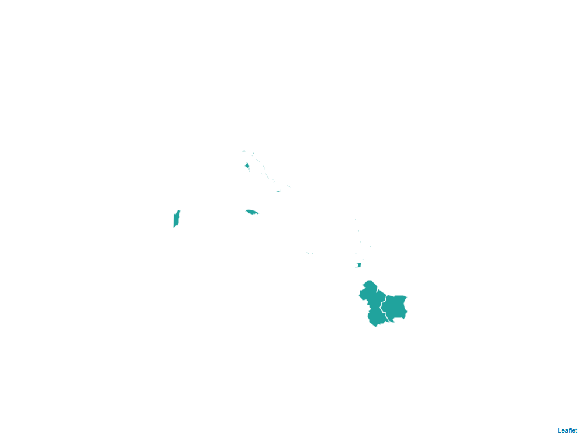

```{r setup, include=FALSE, echo=F}
##############################################################
# Herramienta digital Análisis de Riesgo SR - QA_report.Rmd
# Organización Panamericana de la Salud
# Autor: Luis Quezada
# Última fecha de modificación: 2023-10-11
# R 4.3.0
##############################################################

Sys.setlocale(locale = "es_ES.UTF-8")
options(knitr.duplicate.label = "allow", scipen = 999)
knitr::opts_chunk$set(echo = F, warning= F, message = F)

# Libraries
library(pacman)
p_load(tidyverse,tidyr,readxl,
       webshot,sf,sp,mapview,leaflet,
       htmltools,DT,data.table)

# PATHS ----
PATH_country_data   = "../Data/country_data.xlsx"
PATH_country_flag   = "../Data/country_flag.png"
PATH_shapefiles     = "../Data/shapefiles/"

# HTML - CSS
html_white_background <- htmltools::tags$style(".leaflet-container { background: #FFF; }")

# LANG
LANG <- as.character(read_excel(PATH_country_data,sheet = 1)[8,2])
if (!(LANG %in% c("SPA","ENG","FRA","POR"))) {LANG = "SPA"}
LANG_TLS <- read_excel("translations.xlsx",sheet="QA_REPORT") %>% select(LABEL,all_of(LANG))
colnames(LANG_TLS) <- c("LABEL","LANG")
lang_label <- function(label) {
  return(LANG_TLS$LANG[LANG_TLS$LABEL == label])
}

# Functions
cFormat <- function(x,n) {
  cf <- format(round(as.numeric(x),n), nsmall=n, big.mark=",")
  return (cf)
}

get_test_na_df <- function(df) {
  dat_test_na_df <- as.data.frame(colSums(is.na(df)))
  colnames(dat_test_na_df) <- c("n_miss")
  dat_test_na_df$var <- rownames(dat_test_na_df)
  rownames(dat_test_na_df) = NULL
  dat_test_na_df <- dat_test_na_df %>% mutate(test_na = case_when(
    n_miss > 0 ~ lang_label("na_test_yes"),
    n_miss <= 0 ~ lang_label("na_test_no")
  )) %>% select(var,test_na,n_miss)
  colnames(dat_test_na_df) = c(lang_label("na_test_var"),
                               lang_label("na_test_na_data"),
                               lang_label("na_test_n"))
  return(dat_test_na_df)
}

cat_na_table <- function(df_all,in_cols=NULL) {
  if (is.null(in_cols)) {
    na_rows_df <- df_all[!complete.cases(df_all),]
  } else {
    na_rows_df <- df_all[!complete.cases(df_all[in_cols]),]
  }
  if (nrow(na_rows_df) == 0) {
    na_rows_df <- data.frame(V1="")
    colnames(na_rows_df) <- lang_label("no_missing_data")
  }
  return(knitr::kable(na_rows_df, row.names = F, booktabs = T))
}

cat_invalid_geoid_table <- function(data_df) {
  data_df <- data_df[c(1,3)]
  geo_id_colname <- colnames(data_df)[2]
  colnames(data_df) <- c("FILA","GEO_ID")
  data_df$GEO_ID <- as.character(data_df$GEO_ID)
  country_shapefiles$GEO_ID <- as.character(country_shapefiles$GEO_ID)
  geo_id_merge_df <- full_join(
    data_df,
    as.data.frame(country_shapefiles) %>% select(-geometry),
    by="GEO_ID"
  )
  geo_id_merge_df <- geo_id_merge_df[!complete.cases(geo_id_merge_df),]
  geo_id_merge_df <- geo_id_merge_df %>% filter(!is.na(FILA)) %>% select(-ADMIN1,-ADMIN2)
  colnames(geo_id_merge_df)[1] = lang_label("row")
  if ("ADMIN1_GEO_ID" %in% colnames(geo_id_merge_df)) {
    geo_id_merge_df <- geo_id_merge_df %>% select(-ADMIN1_GEO_ID)
  }
  colnames(geo_id_merge_df)[2] <- geo_id_colname
  if (nrow(geo_id_merge_df) == 0) {
    geo_id_merge_df <- data.frame(V1="")
    colnames(geo_id_merge_df) = c(lang_label("no_invalid_geocode"))
  }
  return(knitr::kable(geo_id_merge_df, booktabs = T))
}

has_invalid_geoid <- function(data_df) {
  data_df <- data_df[c(1,3)]
  colnames(data_df) <- c("FILA","GEO_ID")
  data_df$GEO_ID <- as.character(data_df$GEO_ID)
  country_shapefiles$GEO_ID <- as.character(country_shapefiles$GEO_ID)
  geo_id_merge_df <- full_join(
    data_df,
    as.data.frame(country_shapefiles) %>% select(-geometry),
    by="GEO_ID"
  )
  geo_id_merge_df <- geo_id_merge_df[!complete.cases(geo_id_merge_df),]
  geo_id_merge_df <- geo_id_merge_df %>% filter(!is.na(FILA)) %>% select(-ADMIN1,-ADMIN2)
  colnames(geo_id_merge_df)[1] = lang_label("row")
  if (nrow(geo_id_merge_df) != 0) {
    return(paste0("- ",lang_label("no_match_geocode"),"\n"))
  } else {
    return("")
  }
}

# Shapefiles
country_shapefiles <- st_read(PATH_shapefiles,layer="admin2")
if ("ADMIN1_" %in% colnames(country_shapefiles)) {
  country_shapefiles <- country_shapefiles %>% rename("ADMIN1_GEO_ID"="ADMIN1_")}

# OPTS
OPTS_DF <- read_xlsx(PATH_country_data,sheet = "_ListValues")

final_class_opts <- unique(OPTS_DF$`Final Classification`)
final_class_opts <- final_class_opts[!is.na(final_class_opts)]

sex_opts <- unique(OPTS_DF$Sex)
sex_opts <- sex_opts[!is.na(sex_opts)]

doses_opts <- unique(OPTS_DF$`Number Of Doses`)
doses_opts <- doses_opts[!is.na(doses_opts)]

vac_status_opts <- unique(OPTS_DF$`Vaccination Status`)
vac_status_opts <- vac_status_opts[!is.na(vac_status_opts)]

yes_no_opts <- unique(OPTS_DF$`Yes No`)
yes_no_opts <- yes_no_opts[!is.na(yes_no_opts)]

travel_hist_opts <- unique(OPTS_DF$`Travel History`)
travel_hist_opts <- travel_hist_opts[!is.na(travel_hist_opts)]

# Error flag
report_has_errors <- F
```

\newpage
# `r lang_label("title_rev_shp")`
```{r rev_shapefiles, echo=F, out.width="100%"}
fig_map = leaflet(country_shapefiles) %>%
  addPolygons(fillColor = "#079992",fillOpacity = .9,
              weight = 1.5,color = "white", opacity = .7) %>%
  clearTiles() %>% 
  htmlwidgets::prependContent(html_white_background)
mapshot(fig_map, file = "figures/country_shapefiles.png")

```

```{r res_rev_shapefiles, include=FALSE, echo=F}
shp_unique_geoid <- length(unique(country_shapefiles$GEO_ID))
shp_unique_geometry <- length(unique(country_shapefiles$geometry))

shp_test_match_geoid_geometry <- shp_unique_geoid == shp_unique_geometry
shp_test_na_geoid <- sum(is.na(country_shapefiles$GEO_ID)) == 0
shp_test_na_admin1 <- sum(is.na(country_shapefiles$ADMIN1)) == 0
shp_test_na_admin2 <- sum(is.na(country_shapefiles$ADMIN2)) == 0
shp_test_na_geometry <- sum(st_is_empty(country_shapefiles$geometry)) == 0

ERROR_LIST <- ""
if (!shp_test_match_geoid_geometry) {
  ERROR_LIST <- paste0(ERROR_LIST,"- ",lang_label("shp_test_match_geoid_geometry_1")," (",shp_unique_geoid ,") ",lang_label("shp_test_match_geoid_geometry_2")," (",shp_unique_geometry,").\n")
}
if (!shp_test_na_geoid) {
  ERROR_LIST <- paste0(ERROR_LIST,"- ",lang_label("shp_test_na_geoid"),".\n")
}
if (!shp_test_na_admin1) {
  ERROR_LIST <- paste0(ERROR_LIST,"- ",lang_label("shp_test_na_admin1"),".\n")
}
if (!shp_test_na_admin2) {
  ERROR_LIST <- paste0(ERROR_LIST,"- ",lang_label("shp_test_na_admin2"),".\n")
}
if (!shp_test_na_geometry) {
  ERROR_LIST <- paste0(ERROR_LIST,"- ",lang_label("shp_test_na_geometry"),".\n")
}
if (ERROR_LIST == "") {
  ERROR_LIST = paste0("- ",lang_label("test_error_none"),".")
} else {
  report_has_errors <- T
}
```

#### `r lang_label("title_errors_found")`:

`r ERROR_LIST`

#### `r lang_label("title_na_rows")`^[`r lang_label("footnote_na")`].
```{r res_rev_shapefiles_na, echo=F}
na_rows_df <- as.data.frame(country_shapefiles) %>% select(-geometry)
cat_na_table(na_rows_df,in_cols=NULL)
```

\newpage
# `r lang_label("title_rev_country_data")`

### 1. `r lang_label("title_cdata_general")`
```{r rev_data_1, echo=F}
data_sheet_1 <- read_excel(PATH_country_data,sheet = 1)
colnames(data_sheet_1) <- c("VAR","VAL")

dat_test_na_val <- sum(is.na(data_sheet_1$VAL)) == 0
dat_test_int_yeareval <- !is.na(as.integer(data_sheet_1$VAL[2]))
dat_test_int_lastcamp <- !is.na(as.integer(data_sheet_1$VAL[4]))
dat_test_int_mmr1 <- !is.na(as.integer(data_sheet_1$VAL[5]))
dat_test_int_mmr2 <- !is.na(as.integer(data_sheet_1$VAL[6]))
dat_test_outbreak <- data_sheet_1$VAL[7] == yes_no_opts[2]
dat_test_language <- data_sheet_1$VAL[8] %in% c("SPA","ENG","FRA","POR")

ERROR_LIST <- ""
if (!dat_test_na_val) {
  ERROR_LIST <- paste0(ERROR_LIST,"- ",lang_label("cdata_test_na_val"),"\n")
}
if (!dat_test_int_yeareval) {
  ERROR_LIST <- paste0(ERROR_LIST,"- ",lang_label("cdata_error_non_numeric")," *'",data_sheet_1$VAR[2],"'*.\n")
}
if (!dat_test_int_lastcamp) {
  ERROR_LIST <- paste0(ERROR_LIST,"- ",lang_label("cdata_error_non_numeric")," *'",data_sheet_1$VAR[4],"'*.\n")
}
if (!dat_test_int_mmr1) {
  ERROR_LIST <- paste0(ERROR_LIST,"- ",lang_label("cdata_error_non_numeric")," *'",data_sheet_1$VAR[5],"'*.\n")
}
if (!dat_test_int_mmr2) {
  ERROR_LIST <- paste0(ERROR_LIST,"- ",lang_label("cdata_error_non_numeric")," *'",data_sheet_1$VAR[6],"'*.\n")
}
if (!dat_test_outbreak) {
  ERROR_LIST <- paste0(ERROR_LIST,"- ",lang_label("cdata_test_outbreak"),"\n")
}
if (!dat_test_language) {
  ERROR_LIST <- paste0(ERROR_LIST,"- ",lang_label("cdata_test_language"),": 'SPA', 'ENG', 'FRA', 'POR'.\n")
}
if (ERROR_LIST == "") {
  ERROR_LIST = paste0("- ",lang_label("test_error_none"),".")
} else {
  report_has_errors <- T
}
```

#### `r lang_label("title_errors_found")`:

`r ERROR_LIST`


\newpage
### 2. `r lang_label("title_cdata_pob_area")`
```{r rev_data_2, echo=F}
data_sheet_2 <- read_excel(PATH_country_data,sheet = 2)
row_offset <- 1
as_is_colnames <- colnames(data_sheet_2)
dat_test_na_df2 <- get_test_na_df(data_sheet_2)
colnames(data_sheet_2) <- c("ADMIN1 GEO_ID","GEO_ID","ADMIN1","ADMIN2","POB","AREA")
data_sheet_2$`ADMIN1 GEO_ID` <- as.character(data_sheet_2$`ADMIN1 GEO_ID`)
data_sheet_2$GEO_ID <- as.character(data_sheet_2$GEO_ID)

temp_ds_2 <- data_sheet_2
temp_ds_2$POB[is.na(temp_ds_2$POB)] = 0
temp_ds_2$AREA[is.na(temp_ds_2$AREA)] = 0

badrows_num_pob <- which(is.na(as.numeric(temp_ds_2$POB)))
badrows_num_area <- which(is.na(as.numeric(temp_ds_2$AREA)))

test_na_admin1_id <- sum(is.na(data_sheet_2$`ADMIN1 GEO_ID`)) == 0
if (test_na_admin1_id) {text_na_admin1_id = ""} else {text_na_admin1_id = lang_label("test_na_admin1_id")}
test_na_admin1 <- sum(is.na(data_sheet_2$ADMIN1)) == 0
if (test_na_admin1) {text_na_admin1 = ""} else {text_na_admin1 = lang_label("test_na_admin1")}

colnames(data_sheet_2) = as_is_colnames
data_sheet_2$FILA <- as.numeric(rownames(data_sheet_2))+row_offset
data_sheet_2 <- data_sheet_2 %>% select(FILA,everything())
colnames(data_sheet_2)[1] = lang_label("row")
```

#### `r lang_label("title_na_vars")`.
```{r, echo=F}
if (sum(dat_test_na_df2[3]) > 0) {report_has_errors <- T}
knitr::kable(dat_test_na_df2,align = "lrrrrrr", booktabs = T)
```
- `r text_na_admin1_id`
- `r text_na_admin1`

#### `r lang_label("title_na_rows")`^[`r lang_label("footnote_na")`].
```{r, echo=F}
na_table <- data_sheet_2
cat_na_table(na_table,in_cols=c(3,5,6,7))
```


#### `r lang_label("title_invalid_geocode")`.
```{r, echo=F}
if (has_invalid_geoid(data_sheet_2) != "") {report_has_errors <- T}
cat_invalid_geoid_table(data_sheet_2)
```
`r has_invalid_geoid(data_sheet_2)`

#### `r lang_label("cdata_error_non_numeric_plural")` '`r colnames(data_sheet_2)[6]`'.
```{r, echo=F}
test_table <- data_sheet_2[badrows_num_pob,]
test_table <- test_table %>% select(c(1,2,3,6))
if (nrow(test_table) == 0) {
  test_table <- data.frame(V1="")
  colnames(test_table) = lang_label("no_non_numeric_data")
} else {
  report_has_errors <- T
}
knitr::kable(test_table, booktabs = T)
```

#### `r lang_label("cdata_error_non_numeric_plural")` '`r colnames(data_sheet_2)[7]`'.
```{r, echo=F}
test_table <- data_sheet_2[badrows_num_area,]
test_table <- test_table %>% select(c(1,2,3,7))
if (nrow(test_table) == 0) {
  test_table <- data.frame(V1="")
  colnames(test_table) = lang_label("no_non_numeric_data")
} else {
  report_has_errors <- T
}
knitr::kable(test_table, booktabs = T)
```


\newpage
### 3. `r lang_label("title_cdata_inm")`
```{r rev_data_3, echo=F}
YEAR_EVAL <- as.integer(data_sheet_1$VAL[2])
YEAR_1 = YEAR_EVAL - 5
YEAR_2 = YEAR_EVAL - 4
YEAR_3 = YEAR_EVAL - 3
YEAR_4 = YEAR_EVAL - 2
YEAR_5 = YEAR_EVAL - 1

data_sheet_3 <- read_excel(PATH_country_data,sheet = 3)
colnames(data_sheet_3)[5:15] <- c(
  paste(lang_label("name_mmr1"),YEAR_1),
  paste(lang_label("name_mmr1"),YEAR_2),
  paste(lang_label("name_mmr1"),YEAR_3),
  paste(lang_label("name_mmr1"),YEAR_4),
  paste(lang_label("name_mmr1"),YEAR_5),
  paste(lang_label("name_mmr2"),YEAR_1),
  paste(lang_label("name_mmr2"),YEAR_2),
  paste(lang_label("name_mmr2"),YEAR_3),
  paste(lang_label("name_mmr2"),YEAR_4),
  paste(lang_label("name_mmr2"),YEAR_5),
  lang_label("name_cob_last_camp")
)
row_offset <- 2

data_sheet_3 <- data_sheet_3[-c(1),] # Remove calc year row
dat_test_na_df3 <- get_test_na_df(data_sheet_3)
as_is_colnames <- colnames(data_sheet_3)
colnames(data_sheet_3) <- c(
  "ADMIN1 GEO_ID","GEO_ID","ADMIN1","ADMIN2",
  paste(lang_label("name_mmr1"),YEAR_1),
  paste(lang_label("name_mmr1"),YEAR_2),
  paste(lang_label("name_mmr1"),YEAR_3),
  paste(lang_label("name_mmr1"),YEAR_4),
  paste(lang_label("name_mmr1"),YEAR_5),
  paste(lang_label("name_mmr2"),YEAR_1),
  paste(lang_label("name_mmr2"),YEAR_2),
  paste(lang_label("name_mmr2"),YEAR_3),
  paste(lang_label("name_mmr2"),YEAR_4),
  paste(lang_label("name_mmr2"),YEAR_5),
  "cob_last_camp")
data_sheet_3$`ADMIN1 GEO_ID` <- as.character(data_sheet_3$`ADMIN1 GEO_ID`)
data_sheet_3$GEO_ID <- as.character(data_sheet_3$GEO_ID)

test_na_admin1_id <- sum(is.na(data_sheet_3$`ADMIN1 GEO_ID`)) == 0
if (test_na_admin1_id) {text_na_admin1_id = ""} else {text_na_admin1_id = lang_label("test_na_admin1_id")}
test_na_admin1 <- sum(is.na(data_sheet_3$ADMIN1)) == 0
if (test_na_admin1) {text_na_admin1 = ""} else {text_na_admin1 = lang_label("test_na_admin1")}

colnames(data_sheet_3) = as_is_colnames
data_sheet_3$FILA <- as.numeric(rownames(data_sheet_3))+row_offset
data_sheet_3 <- data_sheet_3 %>% select(FILA,everything())
colnames(data_sheet_3)[1] = lang_label("row")
```

#### `r lang_label("title_na_vars")`.
```{r, echo=F}
if (sum(dat_test_na_df3[3]) > 0) {report_has_errors <- T}
knitr::kable(dat_test_na_df3,align = "lrrrrrr", booktabs = T)
```
- `r text_na_admin1_id`
- `r text_na_admin1`

#### `r lang_label("title_missing_id")`^[`r lang_label("footnote_na")`].
```{r, echo=F}
na_table <- data_sheet_3 %>% select(c(1:5))
cat_na_table(na_table,in_cols=c(3,5))
```

#### `r lang_label("title_invalid_geocode")`.
```{r, echo=F}
if (has_invalid_geoid(data_sheet_3) != "") {report_has_errors <- T}
cat_invalid_geoid_table(data_sheet_3)
```
`r has_invalid_geoid(data_sheet_3)`

#### `r lang_label("no_na_nonnum_data")` (`r lang_label("name_mmr1")`)
```{r, echo=F}
idx <- c(6:10)
temp_data_sheet_3 <- data_sheet_3
temp_data_sheet_3[, idx] <- lapply(temp_data_sheet_3[, idx], as.numeric)

non_numeric_rows = c()
for (col in idx) {
  non_numeric_rows <- c(non_numeric_rows,which(is.na(temp_data_sheet_3[, col])))
}
non_numeric_rows <- sort(unique(non_numeric_rows))+row_offset

idx <- c(1,2,3,idx)
test_table <- data_sheet_3[,idx]
colnames(test_table)[1] = "FILA"
test_table <- test_table %>% filter(FILA %in% non_numeric_rows)
if (nrow(test_table) == 0) {
  test_table <- data.frame(V1="")
  colnames(test_table) = lang_label("no_na_nonnum_data")
} else {
  report_has_errors <- T
  colnames(test_table)[1] = lang_label("row")
}
knitr::kable(test_table, booktabs = T)
```

#### `r lang_label("no_na_nonnum_data")` (`r lang_label("name_mmr2")`, `r lang_label("name_cob_last_camp")`)
```{r, echo=F}
idx <- c(11:16)
temp_data_sheet_3 <- data_sheet_3
temp_data_sheet_3[, idx] <- lapply(temp_data_sheet_3[, idx], as.numeric)

non_numeric_rows = c()
for (col in idx) {
  non_numeric_rows <- c(non_numeric_rows,which(is.na(temp_data_sheet_3[, col])))
}
non_numeric_rows <- sort(unique(non_numeric_rows))+row_offset

idx <- c(1,2,3,idx)
test_table <- data_sheet_3[,idx]
colnames(test_table)[1] = "FILA"
test_table <- test_table %>% filter(FILA %in% non_numeric_rows)
if (nrow(test_table) == 0) {
  test_table <- data.frame(V1="")
  colnames(test_table) = lang_label("no_na_nonnum_data")
} else {
  report_has_errors <- T
  colnames(test_table)[1] = lang_label("row")
}
knitr::kable(test_table, booktabs = T)
```

\newpage
### 4. `r lang_label("title_cdata_prog_del")`
```{r rev_data_4, echo=F}
data_sheet_4 <- read_excel(PATH_country_data,sheet = 4)
row_offset <- 2
data_sheet_4 <- data_sheet_4[-c(1),] # Remove calc year row
colnames(data_sheet_4)[8:9] <- c(lang_label("cdata_dropout_rate_1"),
                                 lang_label("cdata_dropout_rate_2"))
as_is_colnames <- colnames(data_sheet_4)
dat_test_na_df4 <- get_test_na_df(data_sheet_4)

colnames(data_sheet_4) <- c("ADMIN1 GEO_ID","GEO_ID","ADMIN1","ADMIN2",
                            "d_PENTA1","d_SRP1","d_SRP2",
                            "tasa_des_srp1_srp2","tasa_des_penta1_srp1")
data_sheet_4$`ADMIN1 GEO_ID` <- as.character(data_sheet_4$`ADMIN1 GEO_ID`)
data_sheet_4$GEO_ID <- as.character(data_sheet_4$GEO_ID)

test_na_admin1_id <- sum(is.na(data_sheet_4$`ADMIN1 GEO_ID`)) == 0
if (test_na_admin1_id) {text_na_admin1_id = ""} else {text_na_admin1_id = lang_label("test_na_admin1_id")}
test_na_admin1 <- sum(is.na(data_sheet_4$ADMIN1)) == 0
if (test_na_admin1) {text_na_admin1 = ""} else {text_na_admin1 = lang_label("test_na_admin1")}

colnames(data_sheet_4) = as_is_colnames
data_sheet_4$FILA <- as.numeric(rownames(data_sheet_4))+row_offset
data_sheet_4 <- data_sheet_4 %>% select(FILA,everything())
colnames(data_sheet_4)[1] = lang_label("row")
```

#### `r lang_label("title_na_vars")`.
```{r, echo=F}
if (sum(dat_test_na_df4[3]) > 0) {report_has_errors <- T}
knitr::kable(dat_test_na_df4,align = "lrrrrrr", booktabs = T)
```
- `r text_na_admin1_id`
- `r text_na_admin1`

#### `r lang_label("title_missing_id")`^[`r lang_label("footnote_na")`].
```{r, echo=F}
na_table <- data_sheet_4 %>% select(c(1:5))
cat_na_table(na_table,in_cols=c(3,5))
```

#### `r lang_label("title_invalid_geocode")`.
```{r, echo=F}
if (has_invalid_geoid(data_sheet_4) != "") {report_has_errors <- T}
cat_invalid_geoid_table(data_sheet_4)
```
`r has_invalid_geoid(data_sheet_4)`

#### `r lang_label("title_invalid_dropout_rate")`.
```{r, echo=F}
idx <- c(6:10)
temp_data_sheet_4 <- data_sheet_4
temp_data_sheet_4[, idx] <- lapply(temp_data_sheet_4[, idx], as.numeric)

non_numeric_rows = c()
for (col in idx) {
  non_numeric_rows <- c(non_numeric_rows,which(is.na(temp_data_sheet_4[, col])))
}
non_numeric_rows <- sort(unique(non_numeric_rows))+row_offset

idx <- c(1,2,3,idx)
test_table <- data_sheet_4[,idx]
colnames(test_table)[1] = "FILA"
test_table <- test_table %>% filter(FILA %in% non_numeric_rows)
if (nrow(test_table) == 0) {
  test_table <- data.frame(V1="")
  colnames(test_table) = lang_label("no_na_nonnum_data")
} else {
  report_has_errors <- T
  colnames(test_table)[1] = lang_label("row")
}
knitr::kable(test_table, booktabs = T)
```


\newpage
### 5. `r lang_label("title_vul_group")`
```{r rev_data_5, echo=F}
data_sheet_5 <- read_excel(PATH_country_data,sheet = 5)
row_offset <- 2
data_sheet_5 <- data_sheet_5[-c(1),] # Remove calc year row
dat_test_na_df5 <- get_test_na_df(data_sheet_5)
as_is_colnames <- colnames(data_sheet_5)
colnames(data_sheet_5)[1:4] <- c("ADMIN1 GEO_ID","GEO_ID","ADMIN1","ADMIN2")
data_sheet_5$`ADMIN1 GEO_ID` <- as.character(data_sheet_5$`ADMIN1 GEO_ID`)
data_sheet_5$GEO_ID <- as.character(data_sheet_5$GEO_ID)

test_na_admin1_id <- sum(is.na(data_sheet_5$`ADMIN1 GEO_ID`)) == 0
if (test_na_admin1_id) {text_na_admin1_id = ""} else {text_na_admin1_id = lang_label("test_na_admin1_id")}
test_na_admin1 <- sum(is.na(data_sheet_5$ADMIN1)) == 0
if (test_na_admin1) {text_na_admin1 = ""} else {text_na_admin1 = lang_label("test_na_admin1")}

colnames(data_sheet_5) = as_is_colnames
data_sheet_5$FILA <- as.numeric(rownames(data_sheet_5))+row_offset
data_sheet_5 <- data_sheet_5 %>% select(FILA,everything())
colnames(data_sheet_5)[1] = lang_label("row")
```

#### `r lang_label("title_na_vars")`.
```{r, echo=F}
if (sum(dat_test_na_df5[3]) > 0) {report_has_errors <- T}
knitr::kable(dat_test_na_df5,align = "lrrrrrr", booktabs = T)
```
- `r text_na_admin1_id`
- `r text_na_admin1`

#### `r lang_label("title_missing_id")`^[`r lang_label("footnote_na")`].
```{r, echo=F}
na_table <- data_sheet_5 %>% select(c(1:5))
cat_na_table(na_table,in_cols=c(3,5))
```

#### `r lang_label("title_invalid_geocode")`.
```{r, echo=F}
if (has_invalid_geoid(data_sheet_5) != "") {report_has_errors <- T}
cat_invalid_geoid_table(data_sheet_5)
```
`r has_invalid_geoid(data_sheet_5)`

\newpage
### 6. `r lang_label("title_cases")`
```{r rev_data_6, echo=F}
data_sheet_6 <- read_excel(PATH_country_data,sheet = 6,skip = 12)
colnames(data_sheet_6)[1] = "YEAR"
data_sheet_6 <- data_sheet_6 %>% filter(YEAR != "Total")
data_sheet_6_names <- read_excel(PATH_country_data,sheet = 6,skip = 10)
colnames(data_sheet_6) <- colnames(data_sheet_6_names)
dat_test_na_df6 <- get_test_na_df(data_sheet_6)

test_na_geoid <- sum(is.na(data_sheet_6$GEO_ID)) == 0
if (test_na_geoid) {text_na_geoid = ""} else {text_na_geoid = lang_label("cases_test_na_geoid")}

sheet_6_no_cases <- nrow(data_sheet_6) == 0
if (!sheet_6_no_cases) {
  # Select date variables
  data_sheet_6_predatedata <- data_sheet_6 %>% select(5,7,11,14,15,16,17,18)
  
  datedata_valid_POSIX <- as.data.frame(sapply(data_sheet_6_predatedata %>% select(-1), is.POSIXct))
  datedata_valid_POSIX$Var <- rownames(datedata_valid_POSIX)
  datedata_valid_POSIX <- datedata_valid_POSIX %>% select(Var,everything())
  colnames(datedata_valid_POSIX)[2] <- "Val"
  rownames(datedata_valid_POSIX) <- NULL
  
  data_sheet_6_postdatedata = data_sheet_6
  data_sheet_6_postdatedata[c(7,11,14,15,16,17,18)] <- lapply(data_sheet_6_postdatedata[c(7,11,14,15,16,17,18)], as.numeric)
  data_sheet_6_postdatedata <- data_sheet_6_postdatedata %>% select(5,7,11,14,15,16,17,18)
  data_sheet_6_postdatedata <- data_sheet_6_postdatedata %>% filter(!complete.cases(data_sheet_6_postdatedata[c(2,3,4,5,6,7)]))
  
  data_sheet_6_postdatedata_temp <- data_sheet_6
  prev_name_last_vac_date <- colnames(data_sheet_6_postdatedata_temp)[18]
  colnames(data_sheet_6_postdatedata_temp)[18] = "last_vac_date"
  data_sheet_6_postdatedata_temp <- data_sheet_6_postdatedata_temp %>% 
    filter(!is.na(last_vac_date)) %>%
    mutate(last_vac_date = as.numeric(last_vac_date)) %>%
    select(5,7,11,14,15,16,17,18) %>% filter(
      is.na(last_vac_date)
    )
  colnames(data_sheet_6_postdatedata_temp)[8] = prev_name_last_vac_date
  data_sheet_6_postdatedata <- rbind(data_sheet_6_postdatedata,data_sheet_6_postdatedata_temp)
  
  case_ids_date_problem <- as.list(data_sheet_6_postdatedata[1])
  date_vars_problem <- as.list(datedata_valid_POSIX$Var[datedata_valid_POSIX$Val==F])
  
  colnames(data_sheet_6)[5] = "Case ID"
  if (length(date_vars_problem) > 0) {
    report_has_errors <- T
    date_vars_problem <- c("Case ID",date_vars_problem)
    data_sheet_6_invalid_datedata <- data_sheet_6[, which((names(data_sheet_6) %in% date_vars_problem)==TRUE)]
    data_sheet_6_invalid_datedata <- data_sheet_6_invalid_datedata %>% filter(`Case ID` %in% case_ids_date_problem)
    
    for(i in 2:ncol(data_sheet_6_invalid_datedata)) {
      df_col <- data_sheet_6_invalid_datedata[,i]
      if (!is.POSIXct(df_col)) {
        for (j in 1:nrow(df_col)) {
          if (!is.na(as.numeric(data_sheet_6_invalid_datedata[j,i]))) {
            data_sheet_6_invalid_datedata[j,i] <- NA
          }
        }
      }
    }
    
    idx <- apply(data_sheet_6_invalid_datedata %>% select(-`Case ID`), 1, function(x) all(is.na(x)))
    data_sheet_6_invalid_datedata <- data_sheet_6_invalid_datedata[!idx,]
    data_sheet_6_invalid_datedata[is.na(data_sheet_6_invalid_datedata)] = ""
  } else {
    data_sheet_6_invalid_datedata <- data.frame(V1="")
    colnames(data_sheet_6_invalid_datedata) = lang_label("no_invalid_data")
  }
  
  datedata_valid_POSIX$valid_info <- lang_label("na_test_no")
  datedata_valid_POSIX$valid_info[datedata_valid_POSIX$Val == F] <- lang_label("na_test_yes")
  
} else {
  dat_test_na_df6 <- data.frame(V1="")
  colnames(dat_test_na_df6) = lang_label("cases_not_found")
  
  datedata_valid_POSIX <- data.frame(V1="")
  colnames(datedata_valid_POSIX) = lang_label("cases_not_found")
  
  data_sheet_6_invalid_datedata <- data.frame(V1="")
  colnames(data_sheet_6_invalid_datedata) = lang_label("cases_not_found")
}

```

#### `r lang_label("title_na_vars")`.
```{r rev_data_6_table, echo=F}
if (!sheet_6_no_cases) {
  dat_test_na_df6 = dat_test_na_df6[-(18),]
if (sum(dat_test_na_df6[3]) > 0) {report_has_errors <- T}
}
knitr::kable(dat_test_na_df6,align = "lrrrrrr", booktabs = T, row.names = F)
```
- `r text_na_geoid`

#### `r lang_label("title_cases_valid_date_var")`.
```{r, echo=F}
if (!sheet_6_no_cases) {
  table_valid_POSIX <- datedata_valid_POSIX %>% select(1,3)
  colnames(table_valid_POSIX) = c(lang_label("cases_col_variable"),lang_label("cases_col_has_invalid_data"))
  if (F %in% datedata_valid_POSIX$Val) {report_has_errors <- T}
  knitr::kable(table_valid_POSIX,align = "lrrrrrr", booktabs = T)
} else {
  knitr::kable(datedata_valid_POSIX,align = "lrrrrrr", booktabs = T)
}
```

#### `r lang_label("cases_invalid_date")`^[`r lang_label("cases_invalid_date_note")`].
```{r, echo=F}
knitr::kable(data_sheet_6_invalid_datedata,align = "lrrrrrr", booktabs = T)
```

#### `r lang_label("cases_invalid_dates_1")`:
```{r rev_data_6_date_1, echo=F}
if (!sheet_6_no_cases) {
  if (datedata_valid_POSIX$Val[1] & datedata_valid_POSIX$Val[2]) {
    data_sheet_6_datedata_1 <- data_sheet_6 %>% select(5,7,11)
    prev_names_temp <- colnames(data_sheet_6_datedata_1)
    colnames(data_sheet_6_datedata_1) <- c("Case ID","datevar_birth","datevar_rash")
    data_sheet_6_datedata_1 <- data_sheet_6_datedata_1 %>% 
      mutate(
        datevar_rash = as.Date(datevar_rash),
        datevar_birth = as.Date(datevar_birth)
      ) %>%
      filter(datevar_rash<datevar_birth) %>% 
      select(`Case ID`,datevar_birth,datevar_rash)
    colnames(data_sheet_6_datedata_1) = prev_names_temp
    if (nrow(data_sheet_6_datedata_1) == 0) {
      data_sheet_6_datedata_1 <- data.frame(V1="")
      colnames(data_sheet_6_datedata_1) = lang_label("cases_not_found")
    } else {
      report_has_errors <- T
    }
    knitr::kable(data_sheet_6_datedata_1,align = "lrrrrrr", booktabs = T)
  } else {
    report_has_errors <- T
    cat(paste0(lang_label("cases_error_dates_1"),"."))
  }
  
} else {
  data_sheet_6_datedata_1 <- data.frame(V1="")
  colnames(data_sheet_6_datedata_1) = lang_label("cases_not_found")
  knitr::kable(data_sheet_6_datedata_1,align = "lrrrrrr", booktabs = T)
}
```

#### `r lang_label("cases_invalid_dates_2")`:
```{r rev_data_6_date_2, echo=F}
if (!sheet_6_no_cases) {
  if (datedata_valid_POSIX$Val[5] & datedata_valid_POSIX$Val[2]) {
    data_sheet_6_datedata_2 <- data_sheet_6 %>% select(5,11,16)
    prev_names_temp <- colnames(data_sheet_6_datedata_2)
    colnames(data_sheet_6_datedata_2) <- c("Case ID","datevar_rash","datevar_sample")
    data_sheet_6_datedata_2 <- data_sheet_6_datedata_2 %>% 
      mutate(
        datevar_sample = as.Date(datevar_sample),
        datevar_rash = as.Date(datevar_rash)
      ) %>%
      filter(datevar_sample<datevar_rash) %>% 
      select(`Case ID`,datevar_rash,datevar_sample)
    colnames(data_sheet_6_datedata_2) = prev_names_temp
    if (nrow(data_sheet_6_datedata_2) == 0) {
      data_sheet_6_datedata_2 <- data.frame(V1="")
      colnames(data_sheet_6_datedata_2) = lang_label("cases_not_found")
    } else {
      report_has_errors <- T
    }
    knitr::kable(data_sheet_6_datedata_2,align = "lrrrrrr", booktabs = T)
  } else {
    report_has_errors <- T
    cat(paste0(lang_label("cases_error_dates_2"),"."))
  }
} else {
  data_sheet_6_datedata_2 <- data.frame(V1="")
  colnames(data_sheet_6_datedata_2) = lang_label("cases_not_found")
  knitr::kable(data_sheet_6_datedata_2,align = "lrrrrrr", booktabs = T)
}
```

#### `r lang_label("title_cases_vac_state")`:
```{r rev_data_6_date_3, echo=F}
if (!sheet_6_no_cases) {
  data_sheet_6_vac_state <- data_sheet_6 %>% select(5,12,13)
  prev_names_temp <- colnames(data_sheet_6_vac_state)
  colnames(data_sheet_6_vac_state) <- c("Case ID","vac_state","dose_num")
  
  data_sheet_6_datedata_3_1 <- data_sheet_6_vac_state %>% 
    filter(vac_state == yes_no_opts[1] & !(dose_num %in% doses_opts[2:6])) %>%
    select(`Case ID`,vac_state,dose_num)
  
  data_sheet_6_datedata_3_2 <- data_sheet_6_vac_state %>% 
    filter(vac_state == yes_no_opts[2] & !(dose_num %in% doses_opts[1])) %>%
    select(`Case ID`,vac_state,dose_num)
  
  data_sheet_6_datedata_3_3 <- data_sheet_6_vac_state %>% 
    filter(vac_state == vac_status_opts[3] & !(dose_num %in% doses_opts[6])) %>%
    select(`Case ID`,vac_state,dose_num)
  
  data_sheet_6_datedata_3_4 <- data_sheet_6_vac_state %>% 
    filter(vac_state == vac_status_opts[4] & !(dose_num %in% doses_opts[7])) %>%
    select(`Case ID`,vac_state,dose_num)
  
  data_sheet_6_datedata_3 <- rbind(data_sheet_6_datedata_3_1,
                                   data_sheet_6_datedata_3_2,
                                   data_sheet_6_datedata_3_3,
                                   data_sheet_6_datedata_3_4)
  
  if (nrow(data_sheet_6_datedata_3) == 0) {
    data_sheet_6_datedata_3 <- data.frame(V1="")
    colnames(data_sheet_6_datedata_3) = lang_label("cases_not_found")
    INFO_TEXT = ""
  } else {
    report_has_errors <- T
    colnames(data_sheet_6_datedata_3) <- prev_names_temp
    INFO_TEXT = paste0(
      "- ",lang_label("cases_vac_state_dose_error_1"),".\n",
      "- ",lang_label("cases_vac_state_dose_error_2"),".\n",
      "- ",lang_label("cases_vac_state_dose_error_3"),".\n",
      "- ",lang_label("cases_vac_state_dose_error_4"),".\n"
    )
  }
  
  knitr::kable(data_sheet_6_datedata_3,align = "lrrrrrr", booktabs = T)
} else {
  data_sheet_6_datedata_3 <- data.frame(V1="")
    colnames(data_sheet_6_datedata_3) = lang_label("cases_not_found")
    INFO_TEXT = ""
  knitr::kable(data_sheet_6_datedata_3,align = "lrrrrrr", booktabs = T)
}
```

`r INFO_TEXT`

\newpage
### 7. `r lang_label("title_rap_res")`
```{r rev_data_7, echo=F}
data_sheet_7 <- read_excel(PATH_country_data,sheet = 7)
row_offset <- 1
as_is_colnames <- colnames(data_sheet_7)
dat_test_na_df7 <- get_test_na_df(data_sheet_7)
colnames(data_sheet_7) <- c("ADMIN1 GEO_ID","GEO_ID","ADMIN1","ADMIN2","equipo","hospitales_p")
data_sheet_7$`ADMIN1 GEO_ID` <- as.character(data_sheet_7$`ADMIN1 GEO_ID`)
data_sheet_7$GEO_ID <- as.character(data_sheet_7$GEO_ID)

temp_ds_7 <- data_sheet_7
temp_ds_7$hospitales_p[is.na(temp_ds_7$hospitales_p)] = 0

badrows_num_equipo <- which(!(data_sheet_7$equipo %in% yes_no_opts))
badrows_num_hospitales <- which(is.na(as.numeric(temp_ds_7$hospitales_p)))

test_na_admin1_id <- sum(is.na(data_sheet_7$`ADMIN1 GEO_ID`)) == 0
if (test_na_admin1_id) {text_na_admin1_id = ""} else {text_na_admin1_id = lang_label("test_na_admin1_id")}
test_na_admin1 <- sum(is.na(data_sheet_7$ADMIN1)) == 0
if (test_na_admin1) {text_na_admin1 = ""} else {text_na_admin1 = lang_label("test_na_admin1")}

colnames(data_sheet_7) = as_is_colnames
data_sheet_7$FILA <- as.numeric(rownames(data_sheet_7))+row_offset
data_sheet_7 <- data_sheet_7 %>% select(FILA,everything())
colnames(data_sheet_7)[1] = lang_label("row")
```

#### `r lang_label("title_na_vars")`.
```{r, echo=F}
if (sum(dat_test_na_df7[3]) > 0) {report_has_errors <- T}
knitr::kable(dat_test_na_df7,align = "lrrrrrr", booktabs = T)
```
- `r text_na_admin1_id`
- `r text_na_admin1`

#### `r lang_label("title_na_rows")`^[`r lang_label("footnote_na")`].
```{r, echo=F}
na_table <- data_sheet_7
cat_na_table(na_table,in_cols=c(3,5,6,7))
```

#### `r lang_label("title_invalid_geocode")`.
```{r, echo=F}
if (has_invalid_geoid(data_sheet_7) != "") {report_has_errors <- T}
cat_invalid_geoid_table(data_sheet_7)
```
`r has_invalid_geoid(data_sheet_7)`

#### `r lang_label("res_rap_invalid_yesno")` '`r colnames(data_sheet_7)[6]`'.
```{r, echo=F}
test_table <- data_sheet_7[badrows_num_equipo,]
test_table <- test_table %>% select(c(1,2,3,6))
if (nrow(test_table) == 0) {
  test_table <- data.frame(V1="")
  colnames(test_table) = lang_label("no_invalid_data")
} else {
  report_has_errors <- T
}
knitr::kable(test_table, booktabs = T)
```

#### `r lang_label("cdata_error_non_numeric_plural")` '`r colnames(data_sheet_7)[7]`'.
```{r, echo=F}
test_table <- data_sheet_7[badrows_num_hospitales,]
test_table <- test_table %>% select(c(1,2,3,7))
if (nrow(test_table) == 0) {
  test_table <- data.frame(V1="")
  colnames(test_table) = lang_label("no_non_numeric_data")
} else {
  report_has_errors <- T
}
knitr::kable(test_table, booktabs = T)
```


\newpage
# `r lang_label("title_rev_flag")`
### `r lang_label("title_load_flag")`
```{r rev_flag, echo=F}
FLAG_EXISTS <- file.exists(PATH_country_flag)

if (FLAG_EXISTS) {
  FLAG_EXISTS_MSG <- lang_label("flag_exists_msg_success")
} else {
  report_has_errors <- T
  FLAG_EXISTS_MSG <- lang_label("flag_exists_msg_error")
}
```

```{r cat_flag, echo=F, out.width="50%"}
if (FLAG_EXISTS) {
  knitr::include_graphics(PATH_country_flag)
}
```

`r FLAG_EXISTS_MSG`.

