```{r setup, include=FALSE}
##############################################################
# Herramienta digital Análisis de Riesgo SR - SR_report_WORD.Rmd
# Organización Panamericana de la Salud
# Autor: Luis Quezada
# Última fecha de modificación: 2023-08-17
# R 4.3.0
##############################################################

Sys.setlocale(locale = "es_ES.UTF-8")
options(knitr.duplicate.label = "allow", scipen = 999)
knitr::opts_chunk$set(echo = F, warning= F, message = F)

# Load RData created by risk_tool.R
load(file = "Dashboard/SR_BD.RData")

# Libraries
library(mapview)
library(knitr)
library(leaflet)
library(htmltools)
library(RColorBrewer)
library(readxl)
library(sf)
library(tidyverse)
library(janitor)

# SOURCE
source("Dashboard/general.R")
source("Dashboard/inm_pob.R")
source("Dashboard/surv_qual.R")
source("Dashboard/prog_del.R")
source("Dashboard/vul_group.R")
source("Dashboard/thre_asse.R")
source("Dashboard/rap_res.R")

# LANG
LANG_TLS <- read_excel("translations.xlsx",sheet="REPORT") %>% select(LABEL,all_of(LANG))
colnames(LANG_TLS) <- c("LABEL","LANG")
lang_label <- function(label) {
  return(LANG_TLS$LANG[LANG_TLS$LABEL == label])
}

rep_label_admin2_name <- lang_label("rep_label_admin2_name")
rep_label_admin2_name_plural <- lang_label("rep_label_admin2_name_plural")
title_name_figure <- lang_label("title_name_figure")
title_name_table <- lang_label("title_name_table")
title_name_section <- lang_label("title_name_section")
rep_label_all <- toupper(lang_label("rep_label_all"))

# VARS
VAR_MAP_ZOOM = 6
ref_country_name = COUNTRY_NAME
admin1_geo_id_df <- id_data %>% select(`ADMIN1 GEO_ID`,ADMIN1) %>% unique()
admin1_geo_id_df <- rbind(admin1_geo_id_df,c(0,rep_label_all))

# HTML - CSS
html_white_background <- htmltools::tags$style(".leaflet-container { background: #FFF; }" ) 
html_leaflet_round_legend <- htmltools::tags$style((".leaflet .legend i{ margin-top: 0px;margin-bottom: 5px;border-radius: 5px;}"))
ZOOM_CONFIG = "Mozilla/5.0 (compatible; MSIE 10.6; Windows NT 6.1; Trident/5.0; InfoPath.2; SLCC1; .NET CLR 3.0.4506.2152; .NET CLR 3.5.30729; .NET CLR 2.0.50727) 3gpp-gba UNTRUSTED/1.0"

# Functions
cFormat <- function(x,n) {
  cf <- format(round(as.numeric(x),n), nsmall=n, big.mark=",")
  return (cf)
}

tidy_map <- function(map) {
  #CENTER_LAT = mean(c(map$x$limits$lat[1],map$x$limits$lat[2]))
  #CENTER_LNG = mean(c(map$x$limits$lng[1],map$x$limits$lng[2]))
  map <- map %>% clearTiles() %>% 
    removeControl(layerId = "map_title") %>%
    htmlwidgets::prependContent(html_white_background) %>%  
    htmlwidgets::prependContent(html_leaflet_round_legend) %>% 
    #setView(lat=CENTER_LAT,lng=CENTER_LNG,zoom = VAR_MAP_ZOOM)
  return(map)
}

get_sec_table <- function(risk_levels_df,title_sec) {
  rep_label_num_admin2_VHR = sum(risk_levels_df$n[risk_levels_df$level == lang_label("VHR")])
  rep_label_num_admin2_HR = sum(risk_levels_df$n[risk_levels_df$level == lang_label("HR")])
  rep_label_num_admin2_MR = sum(risk_levels_df$n[risk_levels_df$level == lang_label("MR")])
  rep_label_num_admin2_LR = sum(risk_levels_df$n[risk_levels_df$level == lang_label("LR")])
  rep_label_pct_admin2_VHR = round(rep_label_num_admin2_VHR/ref_num_admin2*100,1)
  rep_label_pct_admin2_HR = round(rep_label_num_admin2_HR/ref_num_admin2*100,1)
  rep_label_pct_admin2_MR = round(rep_label_num_admin2_MR/ref_num_admin2*100,1)
  rep_label_pct_admin2_LR = round(rep_label_num_admin2_LR/ref_num_admin2*100,1)
  
  mun_risk_levels_df <- data.frame(
    cat=c(lang_label("table_cut_offs_LR"),lang_label("table_cut_offs_MR"),
        lang_label("table_cut_offs_HR"),lang_label("table_cut_offs_VHR")),
    num=c(rep_label_num_admin2_LR,rep_label_num_admin2_MR,rep_label_num_admin2_HR,rep_label_num_admin2_VHR),
    pct=c(rep_label_pct_admin2_LR,rep_label_pct_admin2_MR,rep_label_pct_admin2_HR,rep_label_pct_admin2_VHR)
  ) %>% adorn_totals("row")
  if (ref_num_admin2 == mun_risk_levels_df$num[mun_risk_levels_df$cat == "Total"]) {mun_risk_levels_df$pct[mun_risk_levels_df$cat == "Total"] = 100}
  mun_risk_levels_df$num <- cFormat(mun_risk_levels_df$num,0)
  mun_risk_levels_df$pct <- paste0(cFormat(mun_risk_levels_df$pct,1),"%")
  
  colnames(mun_risk_levels_df) <- c(
    title_sec,
    paste0(lang_label("table_number_of")," ",rep_label_admin2_name_plural),
    paste0(lang_label("table_pct_of")," ",rep_label_admin2_name_plural))
  return(mun_risk_levels_df)
}

```

\newpage
# `r lang_label("title_background")`

`r lang_label("background_par_1")`

`r lang_label("background_par_2")`

```{r table_cut_offs, echo=F}
lim_bajo = CUT_OFFS$value[CUT_OFFS$RV == "GENERAL" & CUT_OFFS$risk_level == "LR"]
lim_mediano = CUT_OFFS$value[CUT_OFFS$RV == "GENERAL" & CUT_OFFS$risk_level == "MR"]
lim_alto = CUT_OFFS$value[CUT_OFFS$RV == "GENERAL" & CUT_OFFS$risk_level == "HR"]
lim_muyalto = CUT_OFFS$value[CUT_OFFS$RV == "GENERAL" & CUT_OFFS$risk_level == "VHR"]

cut_offs_table <- data.frame(
  cat=c(lang_label("table_cut_offs_LR"),lang_label("table_cut_offs_MR"),
        lang_label("table_cut_offs_HR"),lang_label("table_cut_offs_VHR")),
  pts=c(
    paste0(lang_label("table_cut_offs_less")," ",lim_bajo+1," ",lang_label("table_cut_offs_unit")),
    paste0(lang_label("table_cut_offs_btwn")," ",lim_bajo+1," ",lang_label("and")," ",lim_mediano," ",lang_label("table_cut_offs_unit")),
    paste0(lang_label("table_cut_offs_btwn")," ",lim_mediano+1," ",lang_label("and")," ",lim_alto," ",lang_label("table_cut_offs_unit")),
    paste0(lang_label("table_cut_offs_more")," ",lim_muyalto," ",lang_label("table_cut_offs_unit"))
  )
)
colnames(cut_offs_table) = c(lang_label("table_cut_offs_riskcats"),lang_label("table_cut_offs_risktotal"))

knitr::kable(cut_offs_table,align = "lr", booktabs = T)
```

## `r lang_label("title_indicators")`

- `r lang_label("ind_pop_inm")` (`r lang_label("ind_total_points")` = `r get_risk_level_point_limit(CUT_OFFS,"INM_POB","VHR")`)
- `r lang_label("ind_surv_qual")` (`r lang_label("ind_total_points")` = `r get_risk_level_point_limit(CUT_OFFS,"SURV_QUAL","VHR")`)
- `r lang_label("ind_prog_del")` (`r lang_label("ind_total_points")` = `r get_risk_level_point_limit(CUT_OFFS,"PROG_DEL","VHR")`)
- `r lang_label("ind_threat")` (`r lang_label("ind_total_points")` = `r get_risk_level_point_limit(CUT_OFFS,"THRE_ASSE","VHR")`)
- `r lang_label("ind_rap_res")` (`r lang_label("ind_total_points")` = `r get_risk_level_point_limit(CUT_OFFS,"RAP_RES","VHR")`)

`r lang_label("indicators_par_1")`

\newpage
## `r lang_label("title_name_section")` 1: `r lang_label("title_section_1")`
```{r table_general_profile, echo=F}
ref_num_admin2 = nrow(indicadores_data)

risk_levels_df <- data.frame(level=get_risk_level(LANG_TLS,CUT_OFFS,"GENERAL",indicadores_data$TOTAL_PR),n=1)

rep_label_num_admin2_VHR = sum(risk_levels_df$n[risk_levels_df$level == lang_label("VHR")])
rep_label_num_admin2_HR = sum(risk_levels_df$n[risk_levels_df$level == lang_label("HR")])
rep_label_num_admin2_MR = sum(risk_levels_df$n[risk_levels_df$level == lang_label("MR")])
rep_label_num_admin2_LR = sum(risk_levels_df$n[risk_levels_df$level == lang_label("LR")])

rep_label_pct_admin2_VHR = round(rep_label_num_admin2_VHR/ref_num_admin2*100,1)
rep_label_pct_admin2_HR = round(rep_label_num_admin2_HR/ref_num_admin2*100,1)
rep_label_pct_admin2_MR = round(rep_label_num_admin2_MR/ref_num_admin2*100,1)
rep_label_pct_admin2_LR = round(rep_label_num_admin2_LR/ref_num_admin2*100,1)
```

`r lang_label("from")` `r ref_num_admin2` `r rep_label_admin2_name_plural` `r lang_label("in")` `r ref_country_name`, `r rep_label_num_admin2_VHR` (`r rep_label_pct_admin2_VHR`%) `r lang_label("section_1_table_VHR")`, `r rep_label_num_admin2_HR` (`r rep_label_pct_admin2_HR`%) `r lang_label("section_1_table_HR")`, `r rep_label_num_admin2_MR` (`r rep_label_pct_admin2_MR`%) `r lang_label("section_1_table_MR")`, `r lang_label("and")` `r rep_label_num_admin2_LR` (`r rep_label_pct_admin2_LR`%) `r lang_label("section_1_table_LR")`.


#### `r title_name_table` 1a: `r lang_label("title_table_1a")`, `r ref_country_name`, `r YEAR_1`-`r YEAR_5`.

```{r table_1a, echo=F,results="asis"}
mun_risk_levels_df <- data.frame(
  cat=c(lang_label("table_cut_offs_LR"),lang_label("table_cut_offs_MR"),
        lang_label("table_cut_offs_HR"),lang_label("table_cut_offs_VHR")),
  num=c(rep_label_num_admin2_LR,rep_label_num_admin2_MR,rep_label_num_admin2_HR,rep_label_num_admin2_VHR),
  pct=c(rep_label_pct_admin2_LR,rep_label_pct_admin2_MR,rep_label_pct_admin2_HR,rep_label_pct_admin2_VHR)
) %>% adorn_totals("row")
if (ref_num_admin2 == mun_risk_levels_df$num[mun_risk_levels_df$cat == "Total"]) {mun_risk_levels_df$pct[mun_risk_levels_df$cat == "Total"] = 100}
mun_risk_levels_df$num <- cFormat(mun_risk_levels_df$num,0)
mun_risk_levels_df$pct <- paste0(cFormat(mun_risk_levels_df$pct,1),"%")

colnames(mun_risk_levels_df) <- c(
  lang_label("table_cut_offs_riskcats"),
  paste0(lang_label("table_number_of")," ",rep_label_admin2_name_plural),
  paste0(lang_label("table_pct_of")," ",rep_label_admin2_name_plural))

knitr::kable(mun_risk_levels_df,align = "lrrrrrr", booktabs = T)
```

#### `r title_name_figure` 1a: `r lang_label("title_figure_1a")` `r ref_country_name`, `r YEAR_1`-`r YEAR_5`.
```{r figure_1a, echo=F, out.width="78%"}
indicadores_prep_map_data = ind_prep_map_data(LANG_TLS,ZERO_POB_LIST,CUT_OFFS,country_shapes,indicadores_data,"GENERAL",0,"ALL")
fig_map <- ind_plot_map_data(LANG_TLS,ZERO_POB_LIST,CUT_OFFS,indicadores_prep_map_data,"GENERAL",0,"ALL")
fig_map <- tidy_map(fig_map)

mapshot(fig_map, file = "figures/fig_1a.png",useragent = ZOOM_CONFIG)
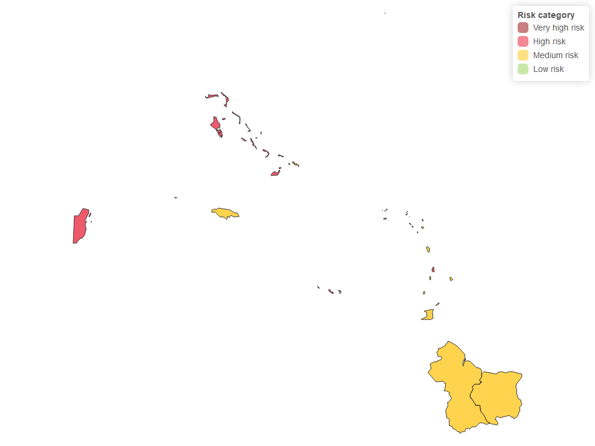
```

#### `r title_name_figure` 1b: `r lang_label("title_figure_1b")`, `r ref_country_name`, `r YEAR_1`-`r YEAR_5`.
```{r figure_1b, echo=F, out.width="78%"}
indicadores_prep_map_data = ind_prep_map_data(LANG_TLS,ZERO_POB_LIST,CUT_OFFS,country_shapes,indicadores_data,"GENERAL",0,"VHR")
fig_map <- ind_plot_map_data(LANG_TLS,ZERO_POB_LIST,CUT_OFFS,indicadores_prep_map_data,"GENERAL",0,"VHR")
fig_map <- tidy_map(fig_map)

mapshot(fig_map, file = "figures/fig_1b.png",useragent = ZOOM_CONFIG)
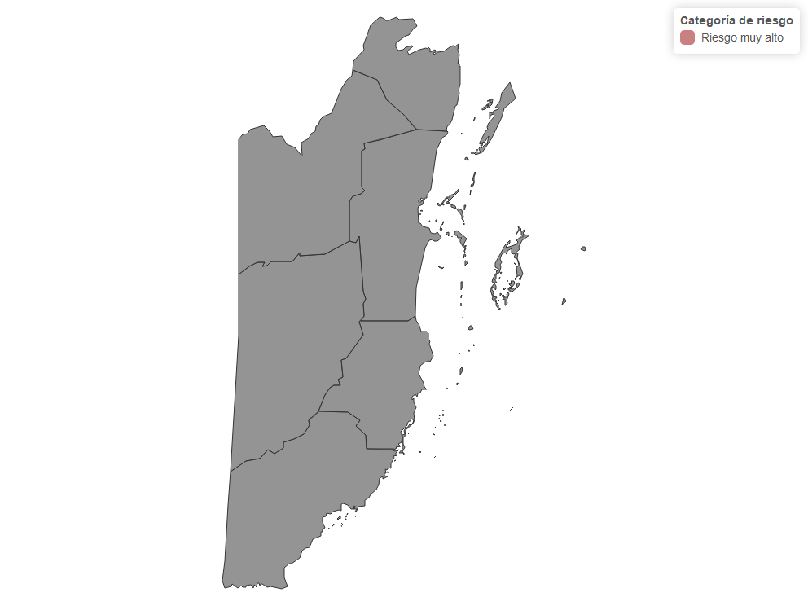
```

#### `r title_name_figure` 1c: `r lang_label("title_figure_1c")`, `r ref_country_name`, `r YEAR_1`-`r YEAR_5`.
```{r figure_1c, echo=F, out.width="78%"}
indicadores_prep_map_data = ind_prep_map_data(LANG_TLS,ZERO_POB_LIST,CUT_OFFS,country_shapes,indicadores_data,"GENERAL",0,"HR")
fig_map <- ind_plot_map_data(LANG_TLS,ZERO_POB_LIST,CUT_OFFS,indicadores_prep_map_data,"GENERAL",0,"HR")
fig_map <- tidy_map(fig_map)

mapshot(fig_map, file = "figures/fig_1c.png",useragent = ZOOM_CONFIG)
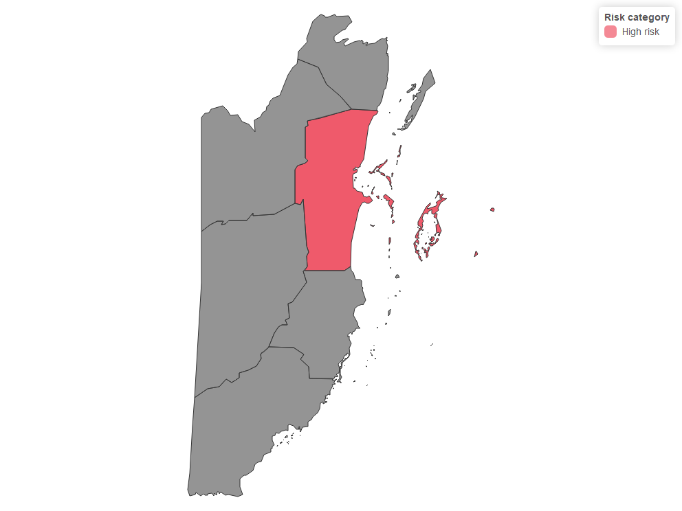
```


\newpage
## `r lang_label("title_name_section")` 2: `r lang_label("title_section_2")`

#### `r title_name_table` 2a: `r lang_label("title_table_2a")`, `r ref_country_name`, `r YEAR_1`-`r YEAR_5`.

```{r table_2a, echo=F}
risk_levels_df <- data.frame(level=get_risk_level(LANG_TLS,CUT_OFFS,"INM_POB",inmunidad_data$TOTAL_PR),n=1)
mun_risk_levels_df <- get_sec_table(risk_levels_df,lang_label("title_section_2"))
knitr::kable(mun_risk_levels_df,align = "lrrrrrr", booktabs = T)
```

#### `r title_name_figure` 2a: `r lang_label("title_figure_2a")`, `r ref_country_name`, `r YEAR_1`-`r YEAR_5`.
```{r figure_2a, echo=F, out.width="90%"}
fig_map <- inmu_plot_map_data(LANG_TLS,YEAR_CAMP_SR,COUNTRY_NAME,YEAR_LIST,ZERO_POB_LIST,CUT_OFFS,country_shapes,inmunidad_data,"TOTAL_PR",rep_label_all,0,admin1_geo_id_df)
fig_map <- tidy_map(fig_map)

mapshot(fig_map, file = "figures/fig_2a.png",useragent = ZOOM_CONFIG)
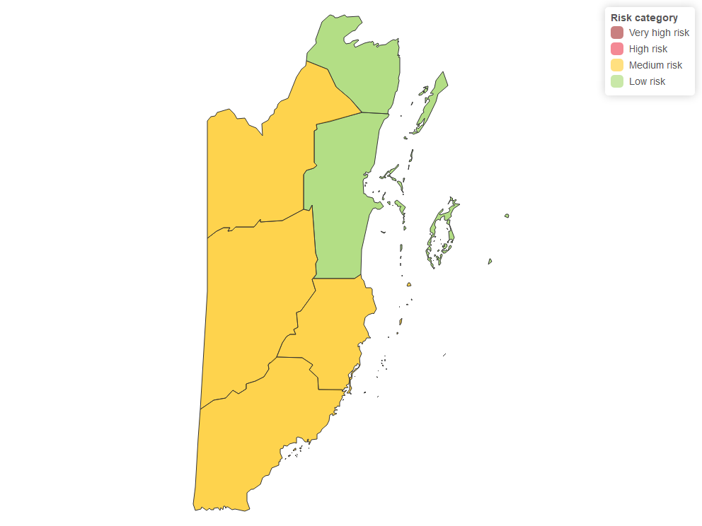
```

\newpage
#### `r title_name_figure` 2b: `r lang_label("title_figure_2b")`, `r ref_country_name`, `r YEAR_CAMP_SR`.
```{r figure_2b, echo=F, out.width="78%"}
fig_map <- inmu_plot_map_data(LANG_TLS,YEAR_CAMP_SR,COUNTRY_NAME,YEAR_LIST,ZERO_POB_LIST,CUT_OFFS,country_shapes,inmunidad_data,"cob_last_camp",rep_label_all,0,admin1_geo_id_df)
fig_map <- tidy_map(fig_map)

mapshot(fig_map, file = "figures/fig_2b.png",useragent = ZOOM_CONFIG)
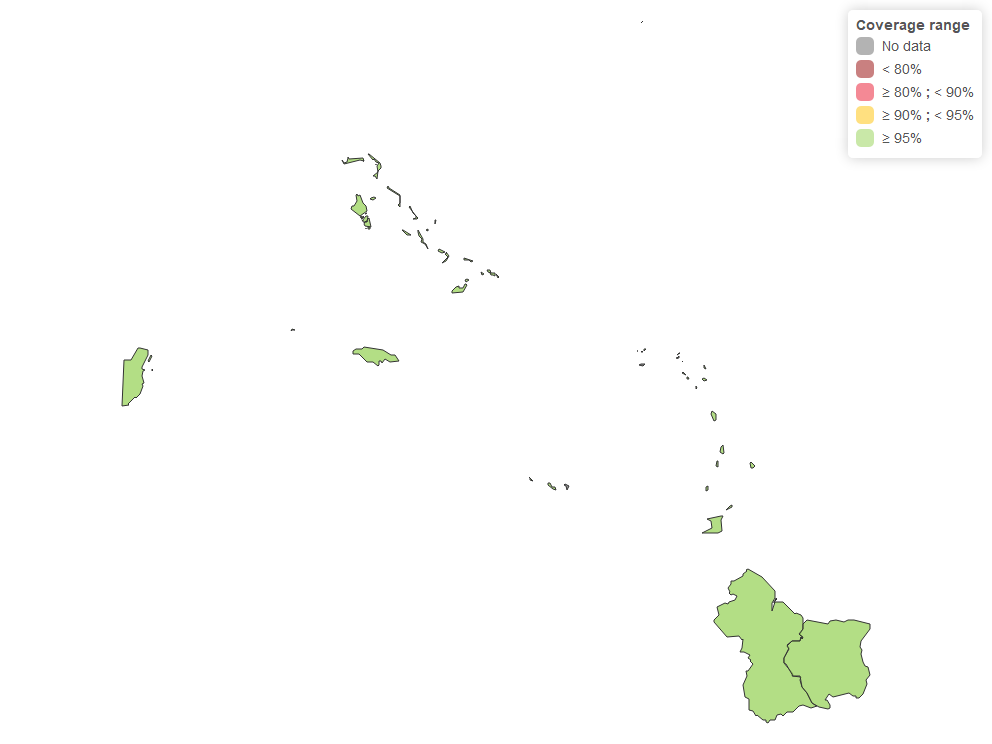
```

#### `r title_name_figure` 2c: `r lang_label("title_figure_2_SPR1")`, `r ref_country_name`, `r YEAR_1`.
```{r figure_2c, echo=F, out.width="78%"}
fig_map <- inmu_plot_map_data(LANG_TLS,YEAR_CAMP_SR,COUNTRY_NAME,YEAR_LIST,ZERO_POB_LIST,CUT_OFFS,country_shapes,inmunidad_data,"SRP1_year1",rep_label_all,0,admin1_geo_id_df)
fig_map <- tidy_map(fig_map)

mapshot(fig_map, file = "figures/fig_2c.png",useragent = ZOOM_CONFIG)
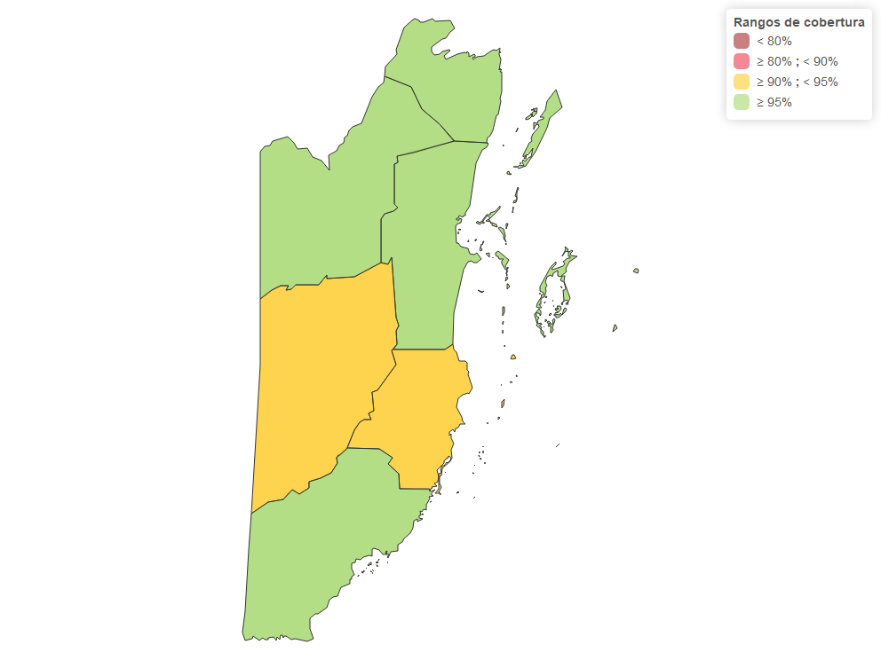
```

\newpage
#### `r title_name_figure` 2d: `r lang_label("title_figure_2_SPR1")`, `r ref_country_name`, `r YEAR_2`.
```{r figure_2d, echo=F, out.width="78%"}
fig_map <- inmu_plot_map_data(LANG_TLS,YEAR_CAMP_SR,COUNTRY_NAME,YEAR_LIST,ZERO_POB_LIST,CUT_OFFS,country_shapes,inmunidad_data,"SRP1_year2",rep_label_all,0,admin1_geo_id_df)
fig_map <- tidy_map(fig_map)

mapshot(fig_map, file = "figures/fig_2d.png",useragent = ZOOM_CONFIG)
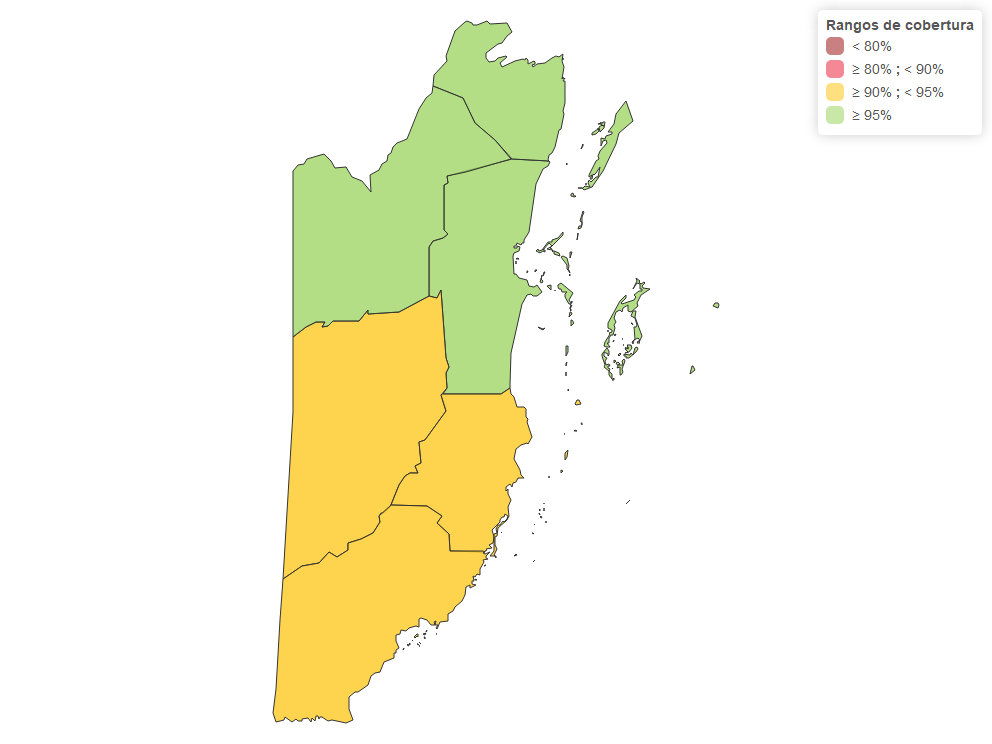
```

#### `r title_name_figure` 2e: `r lang_label("title_figure_2_SPR1")`, `r ref_country_name`, `r YEAR_3`.
```{r figure_2e, echo=F, out.width="78%"}
fig_map <- inmu_plot_map_data(LANG_TLS,YEAR_CAMP_SR,COUNTRY_NAME,YEAR_LIST,ZERO_POB_LIST,CUT_OFFS,country_shapes,inmunidad_data,"SRP1_year3",rep_label_all,0,admin1_geo_id_df)
fig_map <- tidy_map(fig_map)

mapshot(fig_map, file = "figures/fig_2e.png",useragent = ZOOM_CONFIG)
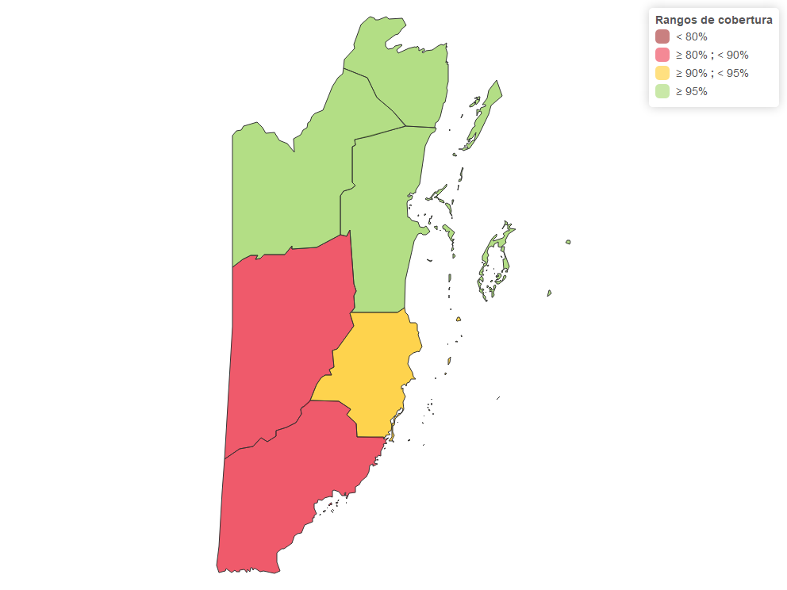
```

\newpage
#### `r title_name_figure` 2f `r lang_label("title_figure_2_SPR1")`, `r ref_country_name`, `r YEAR_4`.
```{r figure_2f, echo=F, out.width="78%"}
fig_map <- inmu_plot_map_data(LANG_TLS,YEAR_CAMP_SR,COUNTRY_NAME,YEAR_LIST,ZERO_POB_LIST,CUT_OFFS,country_shapes,inmunidad_data,"SRP1_year4",rep_label_all,0,admin1_geo_id_df)
fig_map <- tidy_map(fig_map)

mapshot(fig_map, file = "figures/fig_2f.png",useragent = ZOOM_CONFIG)
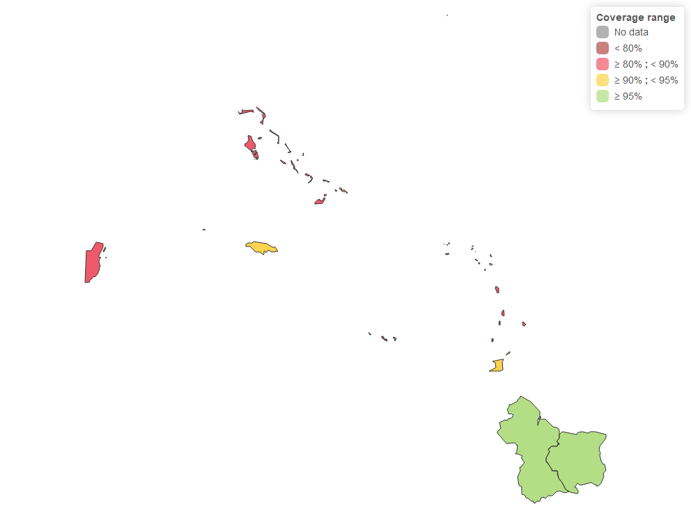
```

#### `r title_name_figure` 2g: `r lang_label("title_figure_2_SPR1")`, `r ref_country_name`, `r YEAR_5`.
```{r figure_2g, echo=F, out.width="78%"}
fig_map <- inmu_plot_map_data(LANG_TLS,YEAR_CAMP_SR,COUNTRY_NAME,YEAR_LIST,ZERO_POB_LIST,CUT_OFFS,country_shapes,inmunidad_data,"SRP1_year5",rep_label_all,0,admin1_geo_id_df)
fig_map <- tidy_map(fig_map)

mapshot(fig_map, file = "figures/fig_2g.png",useragent = ZOOM_CONFIG)
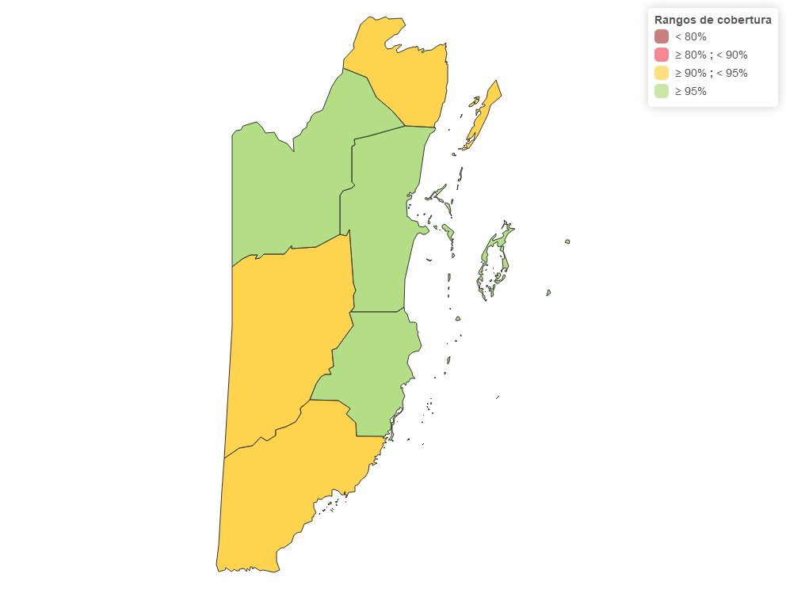
```

\newpage
#### `r title_name_figure` 2h: `r lang_label("title_figure_2_SPR2")`, `r ref_country_name`, `r YEAR_1`.
```{r figure_2h, echo=F, out.width="78%"}
fig_map <- inmu_plot_map_data(LANG_TLS,YEAR_CAMP_SR,COUNTRY_NAME,YEAR_LIST,ZERO_POB_LIST,CUT_OFFS,country_shapes,inmunidad_data,"SRP2_year1",rep_label_all,0,admin1_geo_id_df)
fig_map <- tidy_map(fig_map)

mapshot(fig_map, file = "figures/fig_2h.png",useragent = ZOOM_CONFIG)
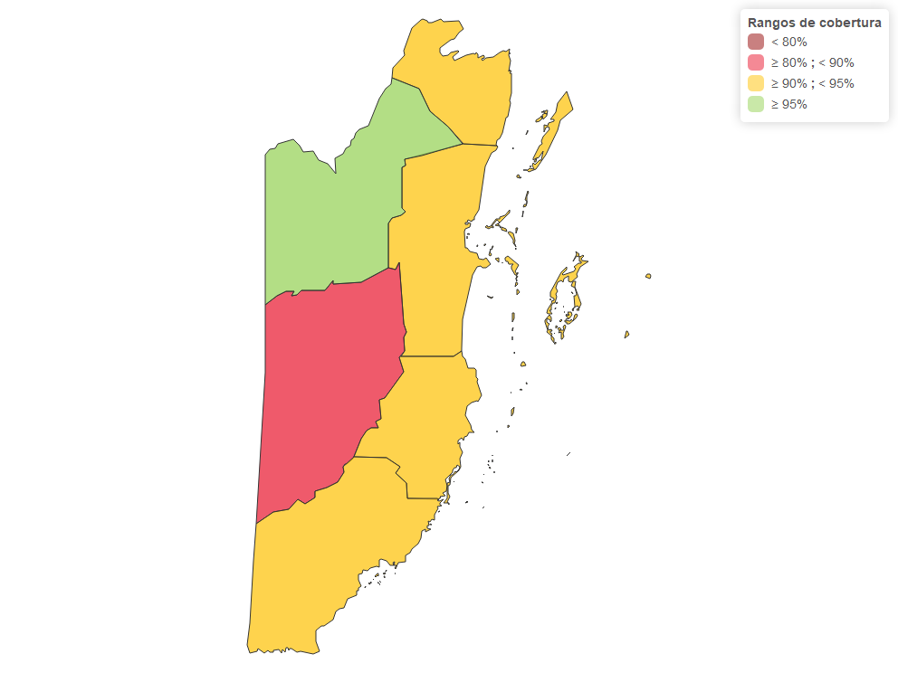
```

#### `r title_name_figure` 2i: `r lang_label("title_figure_2_SPR2")`, `r ref_country_name`, `r YEAR_2`.
```{r figure_2i, echo=F, out.width="78%"}
fig_map <- inmu_plot_map_data(LANG_TLS,YEAR_CAMP_SR,COUNTRY_NAME,YEAR_LIST,ZERO_POB_LIST,CUT_OFFS,country_shapes,inmunidad_data,"SRP2_year2",rep_label_all,0,admin1_geo_id_df)
fig_map <- tidy_map(fig_map)

mapshot(fig_map, file = "figures/fig_2i.png",useragent = ZOOM_CONFIG)
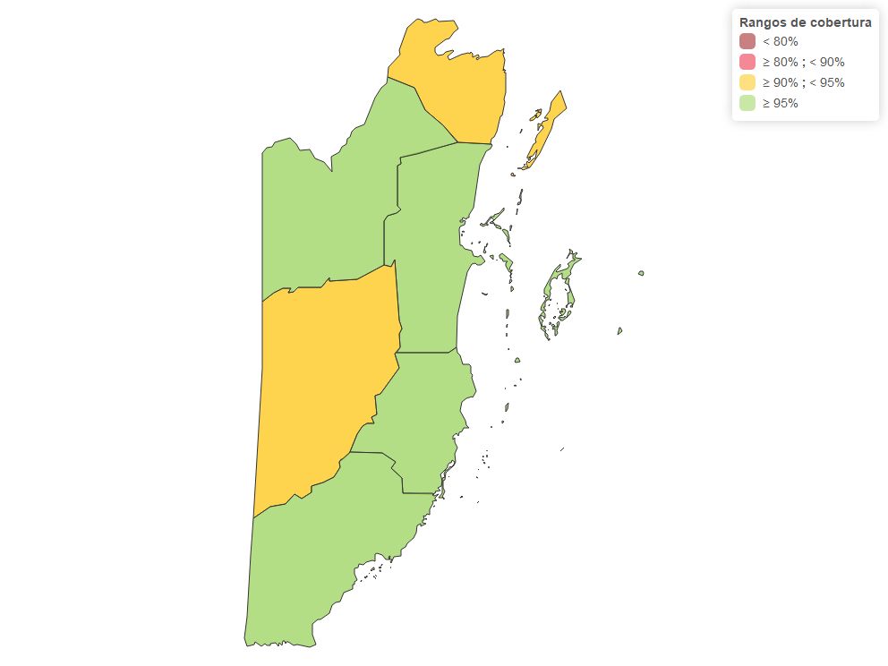
```

\newpage
#### `r title_name_figure` 2j: `r lang_label("title_figure_2_SPR2")`, `r ref_country_name`, `r YEAR_3`.
```{r figure_2j, echo=F, out.width="78%"}
fig_map <- inmu_plot_map_data(LANG_TLS,YEAR_CAMP_SR,COUNTRY_NAME,YEAR_LIST,ZERO_POB_LIST,CUT_OFFS,country_shapes,inmunidad_data,"SRP2_year3",rep_label_all,0,admin1_geo_id_df)
fig_map <- tidy_map(fig_map)

mapshot(fig_map, file = "figures/fig_2j.png",useragent = ZOOM_CONFIG)
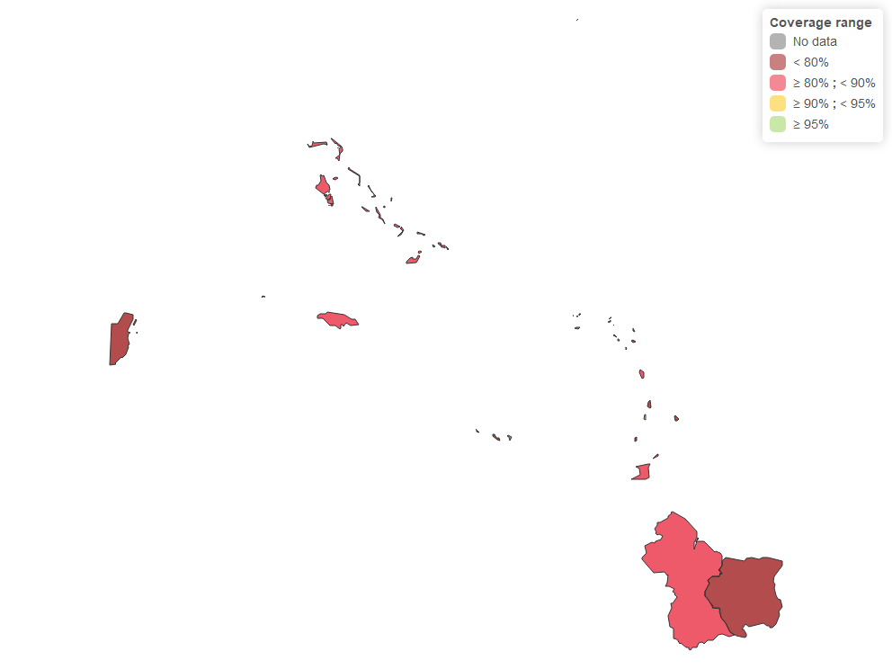
```

#### `r title_name_figure` 2k: `r lang_label("title_figure_2_SPR2")`, `r ref_country_name`, `r YEAR_4`.
```{r figure_2k, echo=F, out.width="78%"}
fig_map <- inmu_plot_map_data(LANG_TLS,YEAR_CAMP_SR,COUNTRY_NAME,YEAR_LIST,ZERO_POB_LIST,CUT_OFFS,country_shapes,inmunidad_data,"SRP2_year4",rep_label_all,0,admin1_geo_id_df)
fig_map <- tidy_map(fig_map)

mapshot(fig_map, file = "figures/fig_2k.png",useragent = ZOOM_CONFIG)
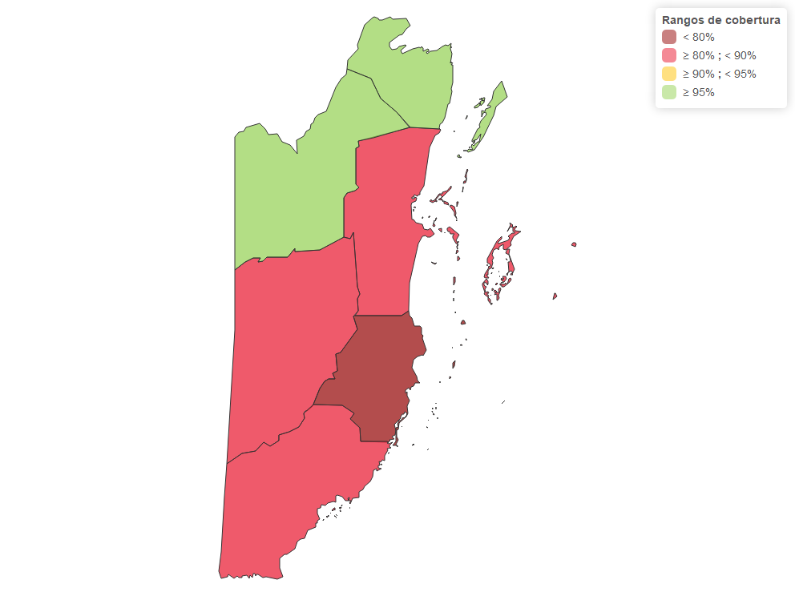
```

\newpage
#### `r title_name_figure` 2l: `r lang_label("title_figure_2_SPR2")`, `r ref_country_name`, `r YEAR_5`.
```{r figure_2l, echo=F, out.width="78%"}
fig_map <- inmu_plot_map_data(LANG_TLS,YEAR_CAMP_SR,COUNTRY_NAME,YEAR_LIST,ZERO_POB_LIST,CUT_OFFS,country_shapes,inmunidad_data,"SRP2_year5",rep_label_all,0,admin1_geo_id_df)
fig_map <- tidy_map(fig_map)

mapshot(fig_map, file = "figures/fig_2l.png",useragent = ZOOM_CONFIG)
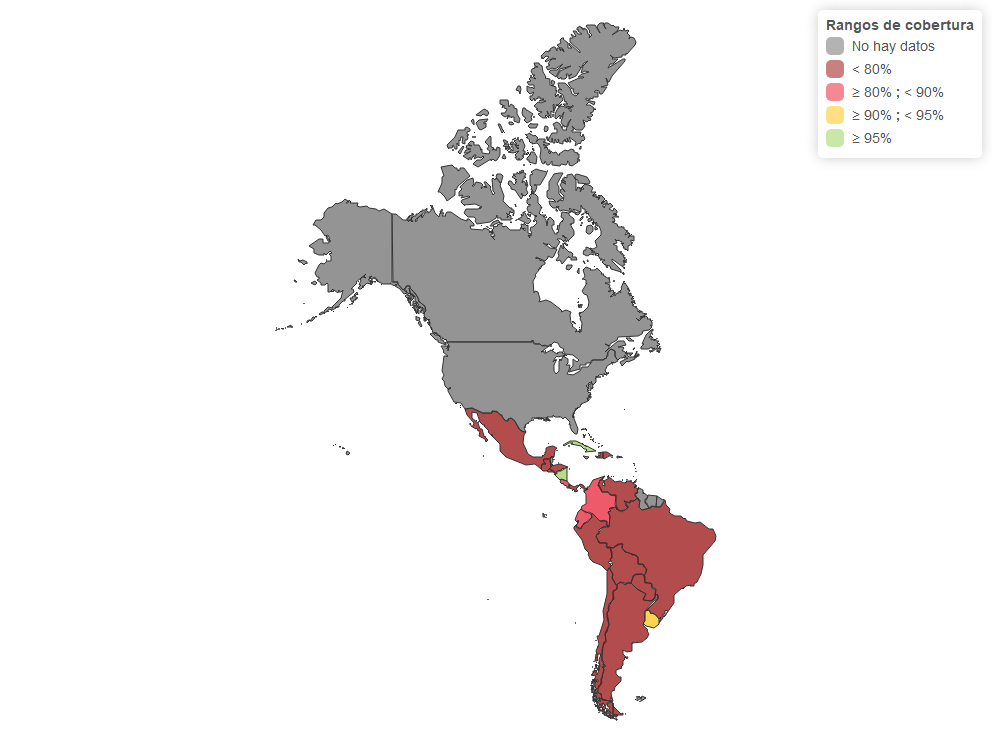
```


\newpage
## `r lang_label("title_name_section")` 3: `r lang_label("title_section_3")`

#### `r title_name_table` 3a: `r lang_label("title_table_3a")`, `r ref_country_name`, `r YEAR_1`-`r YEAR_5`.

```{r table_3a, echo=F}
risk_levels_df <- data.frame(level=get_risk_level(LANG_TLS,CUT_OFFS,"SURV_QUAL",calidad_data$TOTAL_PR),n=1)
mun_risk_levels_df <- get_sec_table(risk_levels_df,lang_label("title_section_3"))
knitr::kable(mun_risk_levels_df,align = "lrrrrrr", booktabs = T)
```

#### `r title_name_figure` 3a: `r lang_label("title_figure_3a")`, `r ref_country_name`, `r YEAR_5`.
```{r figure_3a, echo=F, out.width="90%"}
fig_map <- cal_plot_map_data(LANG_TLS,COUNTRY_NAME,YEAR_LIST,ZERO_POB_LIST,CUT_OFFS,country_shapes,calidad_data,"TOTAL_PR",rep_label_all,0,admin1_geo_id_df)
fig_map <- tidy_map(fig_map)

mapshot(fig_map, file = "figures/fig_3a.png",useragent = ZOOM_CONFIG)
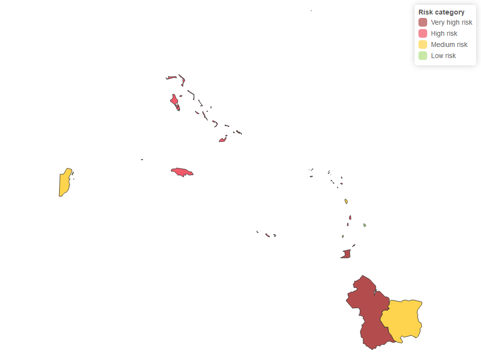
```

\newpage
#### `r title_name_figure` 3b: `r lang_label("title_figure_3b")`^1^, `r ref_country_name`, `r YEAR_5`.
```{r figure_3b, echo=F, out.width="70%"}
fig_map <- cal_plot_map_data(LANG_TLS,COUNTRY_NAME,YEAR_LIST,ZERO_POB_LIST,CUT_OFFS,country_shapes,calidad_data,"tasa_casos",rep_label_all,0,admin1_geo_id_df)
fig_map <- tidy_map(fig_map)

mapshot(fig_map, file = "figures/fig_3b.png",useragent = ZOOM_CONFIG)
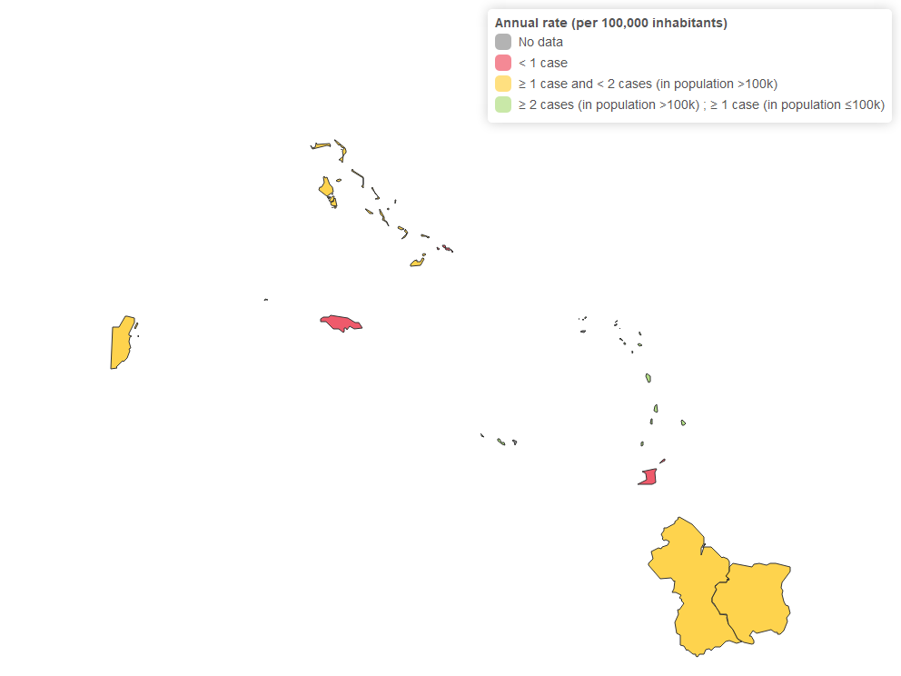
```

^1^ `r lang_label("title_figure_3b_note")`

#### `r title_name_figure` 3c: `r lang_label("title_figure_3c")`, `r ref_country_name`, `r YEAR_5`.
```{r figure_3c, echo=F, out.width="70%"}
fig_map <- cal_plot_map_data(LANG_TLS,COUNTRY_NAME,YEAR_LIST,ZERO_POB_LIST,CUT_OFFS,country_shapes,calidad_data,"p_casos_inv",rep_label_all,0,admin1_geo_id_df)
fig_map <- tidy_map(fig_map)

mapshot(fig_map, file = "figures/fig_3c.png",useragent = ZOOM_CONFIG)
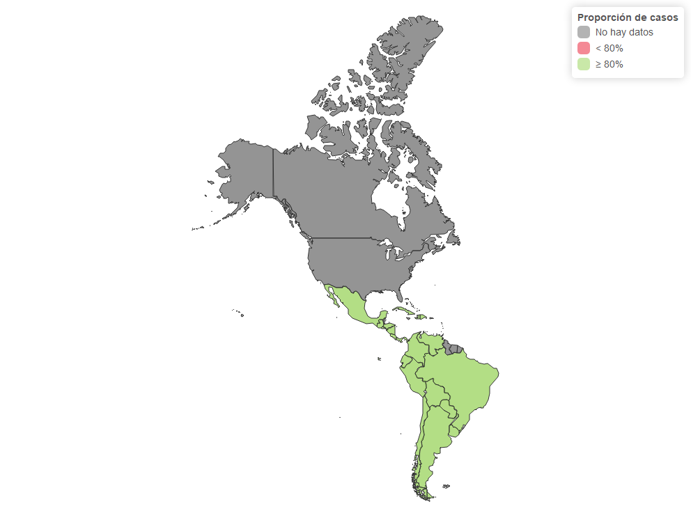
```

\newpage
#### `r title_name_figure` 3d: `r lang_label("title_figure_3d")`, `r ref_country_name`, `r YEAR_5`.
```{r figure_3d, echo=F, out.width="78%"}
fig_map <- cal_plot_map_data(LANG_TLS,COUNTRY_NAME,YEAR_LIST,ZERO_POB_LIST,CUT_OFFS,country_shapes,calidad_data,"p_casos_muestra",rep_label_all,0,admin1_geo_id_df)
fig_map <- tidy_map(fig_map)

mapshot(fig_map, file = "figures/fig_3d.png",useragent = ZOOM_CONFIG)
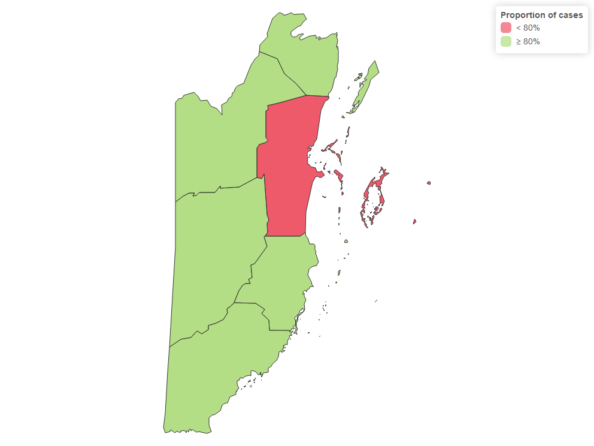
```

#### `r title_name_figure` 3e: `r lang_label("title_figure_3e")`, `r ref_country_name`, `r YEAR_5`.
```{r figure_3e, echo=F, out.width="78%"}
fig_map <- cal_plot_map_data(LANG_TLS,COUNTRY_NAME,YEAR_LIST,ZERO_POB_LIST,CUT_OFFS,country_shapes,calidad_data,"p_muestras_lab",rep_label_all,0,admin1_geo_id_df)
fig_map <- tidy_map(fig_map)

mapshot(fig_map, file = "figures/fig_3e.png",useragent = ZOOM_CONFIG)
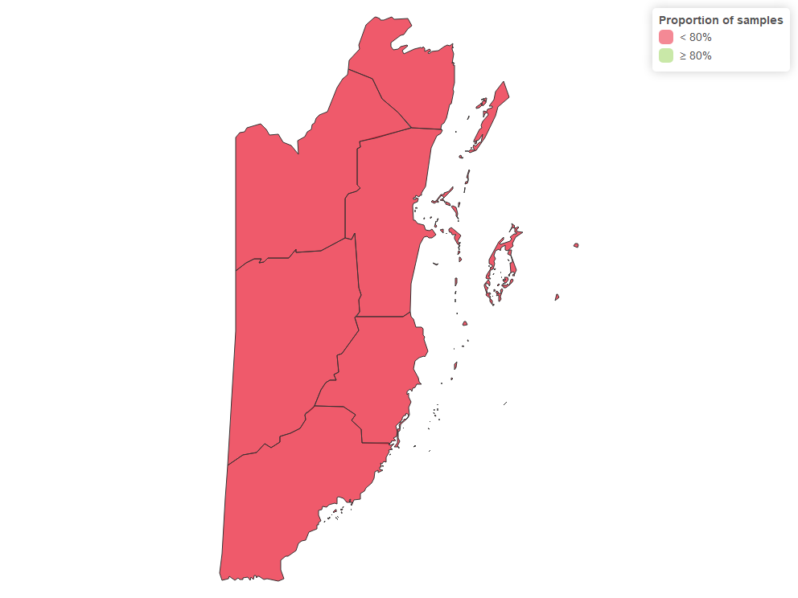
```

\newpage

### `r title_name_table` 3b: `r lang_label("title_figure_3f")`, `r ref_country_name`, `r YEAR_1`-`r YEAR_5`.
```{r table_3b, echo=F}
silent_mun_table <- cal_surv_data_table(LANG_TLS,COUNTRY_NAME,calidad_data)

silent_mun_table
```

#### `r title_name_figure` 3f: `r lang_label("title_figure_3f")`, `r ref_country_name`, `r YEAR_5`.
```{r figure_3f, echo=F, out.width="78%"}
fig_map <- cal_plot_map_data(LANG_TLS,COUNTRY_NAME,YEAR_LIST,ZERO_POB_LIST,CUT_OFFS,country_shapes,calidad_data,"silent_mun",rep_label_all,0,admin1_geo_id_df)
fig_map <- tidy_map(fig_map)

mapshot(fig_map, file = "figures/fig_3f.png",useragent = ZOOM_CONFIG)
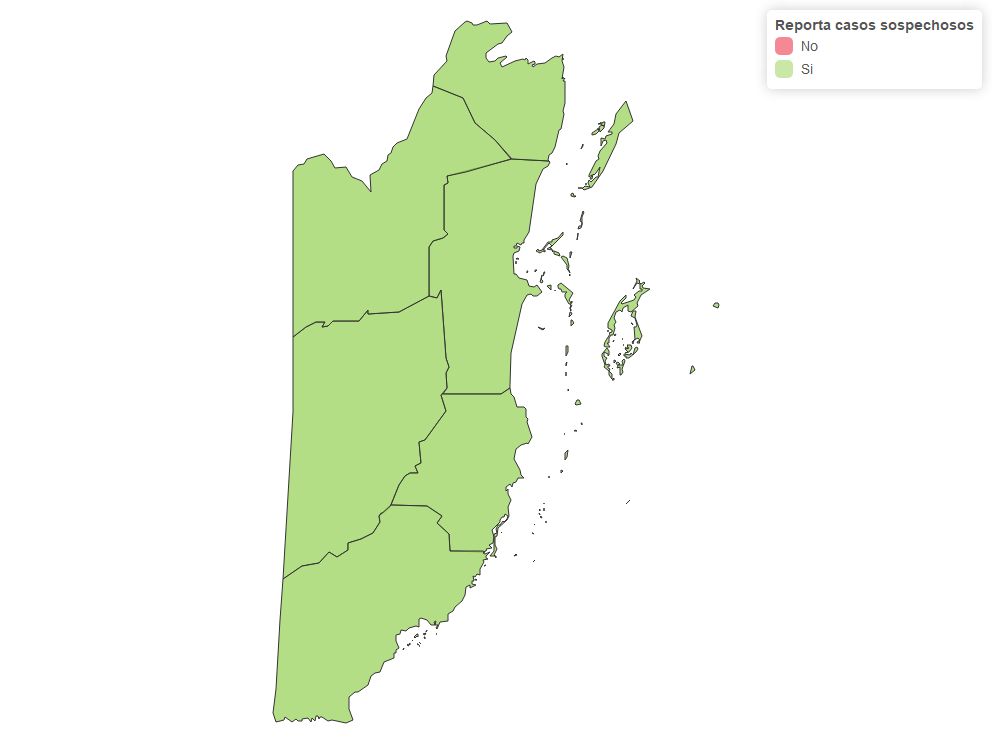
```


\newpage
## `r lang_label("title_name_section")` 4: `r lang_label("title_section_4")`

#### `r title_name_table` 4a: `r lang_label("title_table_4a")`, `r ref_country_name`, `r YEAR_1`-`r YEAR_5`.

```{r table_4a, echo=F}
risk_levels_df <- data.frame(level=get_risk_level(LANG_TLS,CUT_OFFS,"PROG_DEL",rendimiento_data$TOTAL_PR),n=1)
mun_risk_levels_df <- get_sec_table(risk_levels_df,lang_label("title_section_4"))
knitr::kable(mun_risk_levels_df,align = "lrrrrrr", booktabs = T)
```

#### `r title_name_figure` 4a: `r lang_label("title_figure_4a")`, `r ref_country_name`, `r YEAR_1`-`r YEAR_5`.
```{r figure_4a, echo=F, out.width="90%"}
fig_map <- rend_plot_map_data(LANG_TLS,COUNTRY_NAME,YEAR_LIST,ZERO_POB_LIST,CUT_OFFS,country_shapes,rendimiento_data,"TOTAL_PR",rep_label_all,0,admin1_geo_id_df)
fig_map <- tidy_map(fig_map)

mapshot(fig_map, file = "figures/fig_4a.png",useragent = ZOOM_CONFIG)
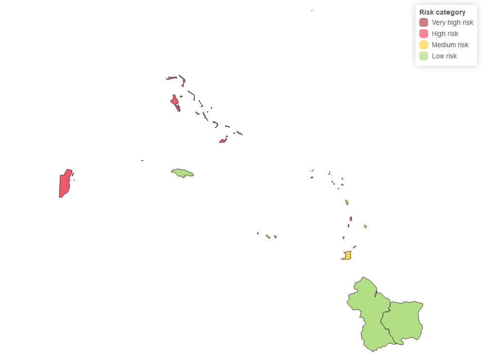
```

\newpage
#### `r title_name_figure` 4b: `r lang_label("title_figure_4b")`, `r ref_country_name`, `r YEAR_1`-`r YEAR_5`.
```{r figure_4b, echo=F, out.width="78%"}
fig_map <- rend_plot_map_data(LANG_TLS,COUNTRY_NAME,YEAR_LIST,ZERO_POB_LIST,CUT_OFFS,country_shapes,rendimiento_data,"tendencia_SRP1",rep_label_all,0,admin1_geo_id_df)
fig_map <- tidy_map(fig_map)

mapshot(fig_map, file = "figures/fig_4b.png",useragent = ZOOM_CONFIG)
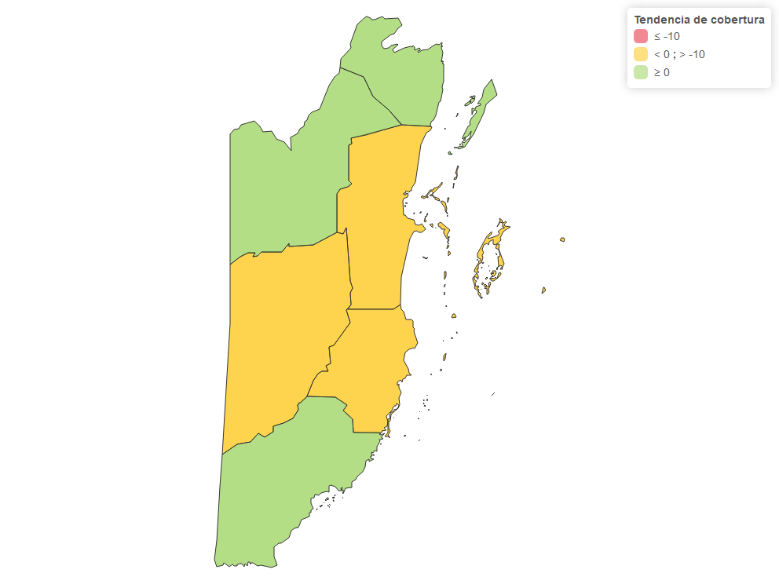
```

#### `r title_name_figure` 4c: `r lang_label("title_figure_4c")`, `r ref_country_name`, `r YEAR_1`-`r YEAR_5`.
```{r figure_4c, echo=F, out.width="78%"}
fig_map <- rend_plot_map_data(LANG_TLS,COUNTRY_NAME,YEAR_LIST,ZERO_POB_LIST,CUT_OFFS,country_shapes,rendimiento_data,"tendencia_SRP2",rep_label_all,0,admin1_geo_id_df)
fig_map <- tidy_map(fig_map)

mapshot(fig_map, file = "figures/fig_4c.png",useragent = ZOOM_CONFIG)
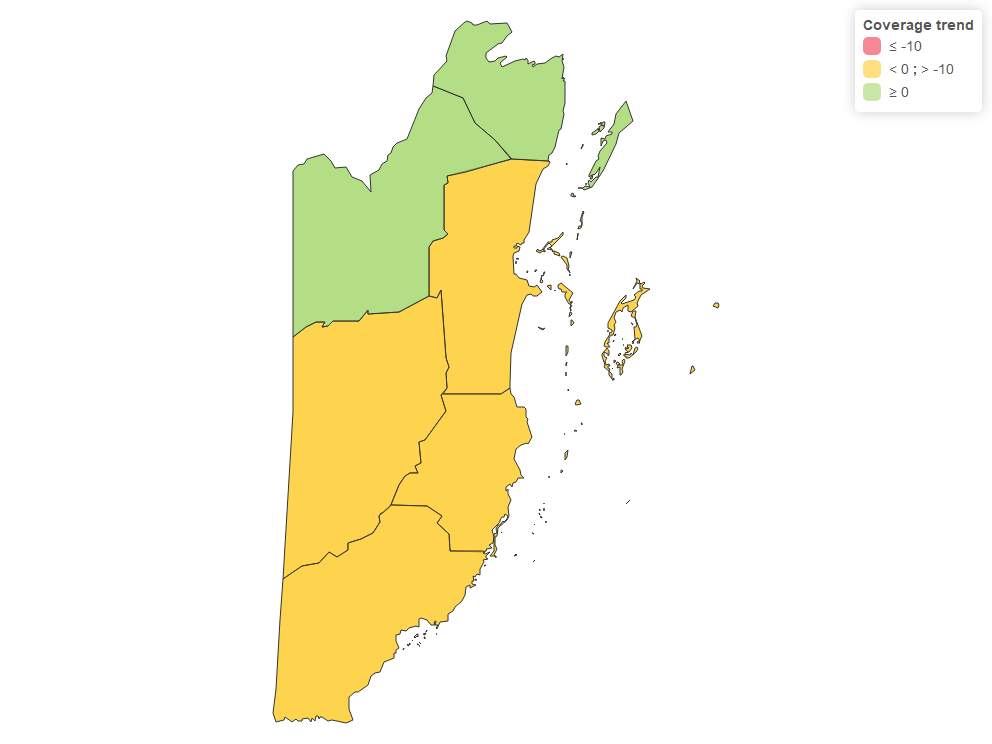
```

\newpage
#### `r title_name_figure` 4d: `r lang_label("title_figure_4d")`, `r ref_country_name`, `r YEAR_5`.
```{r figure_4d, echo=F, out.width="78%"}
fig_map <- rend_plot_map_data(LANG_TLS,COUNTRY_NAME,YEAR_LIST,ZERO_POB_LIST,CUT_OFFS,country_shapes,rendimiento_data,"tasa_des_srp1_srp2",rep_label_all,0,admin1_geo_id_df)
fig_map <- tidy_map(fig_map)

mapshot(fig_map, file = "figures/fig_4d.png",useragent = ZOOM_CONFIG)
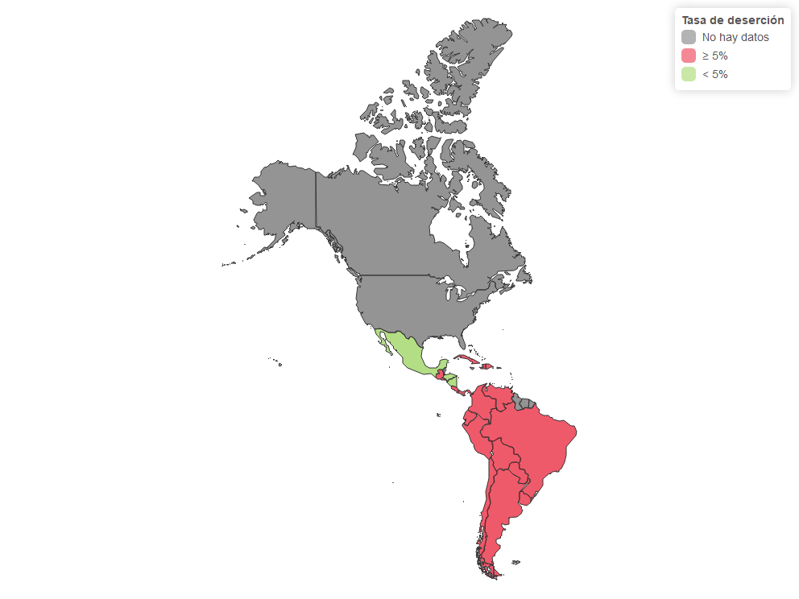
```

#### `r title_name_figure` 4e: `r lang_label("title_figure_4e")`, `r ref_country_name`, `r YEAR_5`.
```{r figure_4e, echo=F, out.width="78%"}
fig_map <- rend_plot_map_data(LANG_TLS,COUNTRY_NAME,YEAR_LIST,ZERO_POB_LIST,CUT_OFFS,country_shapes,rendimiento_data,"tasa_des_penta1_srp1",rep_label_all,0,admin1_geo_id_df)
fig_map <- tidy_map(fig_map)

mapshot(fig_map, file = "figures/fig_4e.png",useragent = ZOOM_CONFIG)
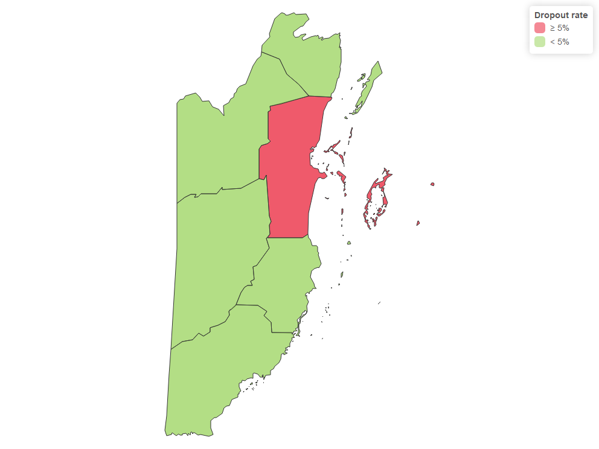
```


\newpage
## `r lang_label("title_name_section")` 5: `r lang_label("title_section_5")`

#### `r title_name_table` 5a: `r lang_label("title_table_5a")`, `r ref_country_name`, `r YEAR_1`-`r YEAR_5`.

```{r table_5a, echo=F}
risk_levels_df <- data.frame(level=get_risk_level(LANG_TLS,CUT_OFFS,"THRE_ASSE",eval_amenaza_data$TOTAL_PR),n=1)
mun_risk_levels_df <- get_sec_table(risk_levels_df,lang_label("title_section_5"))
knitr::kable(mun_risk_levels_df,align = "lrrrrrr", booktabs = T)
```

#### `r title_name_figure` 5a: `r lang_label("title_figure_5a")`, `r ref_country_name`, `r YEAR_1`-`r YEAR_5`.
```{r figure_5a, echo=F, out.width="90%"}
fig_map <- amenaza_plot_map_data(LANG_TLS,COUNTRY_NAME,YEAR_LIST,ZERO_POB_LIST,CUT_OFFS,country_shapes,eval_amenaza_data,"TOTAL_PR",rep_label_all,0,admin1_geo_id_df)
fig_map <- tidy_map(fig_map)

mapshot(fig_map, file = "figures/fig_5a.png",useragent = ZOOM_CONFIG)
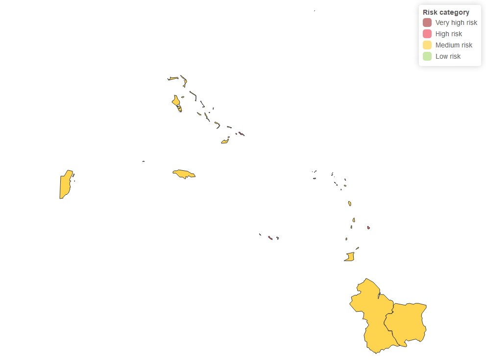
```

\newpage
#### `r title_name_figure` 5b: `r lang_label("title_figure_5b")` km^2^), `r ref_country_name`, `r YEAR_1`-`r YEAR_5`.
```{r figure_5b, echo=F, out.width="78%"}
fig_map <- amenaza_plot_map_data(LANG_TLS,COUNTRY_NAME,YEAR_LIST,ZERO_POB_LIST,CUT_OFFS,country_shapes,eval_amenaza_data,"dens_pob_PR",rep_label_all,0,admin1_geo_id_df)
fig_map <- tidy_map(fig_map)

mapshot(fig_map, file = "figures/fig_5b.png",useragent = ZOOM_CONFIG)
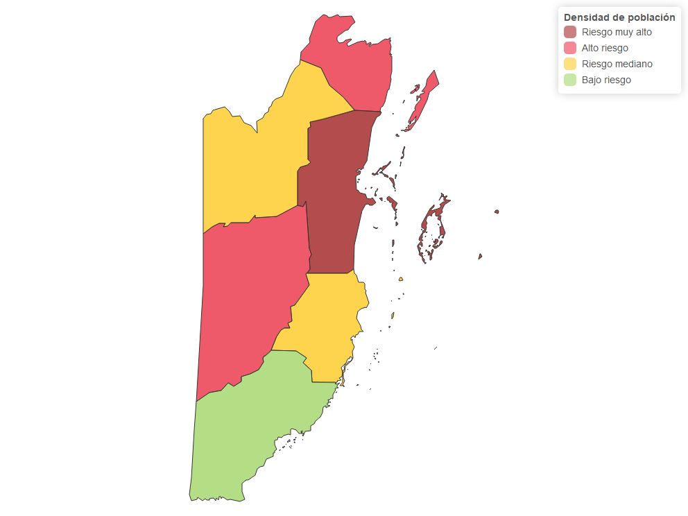
```

#### `r title_name_figure` 5c: `r lang_label("title_figure_5c")`, `r ref_country_name`, `r YEAR_5`.
```{r figure_5c, echo=F, out.width="78%"}
fig_map <- vul_plot_map_data(LANG_TLS,COUNTRY_NAME,YEAR_LIST,ZERO_POB_LIST,CUT_OFFS,country_shapes,vulnerables_data,"TOTAL_PR",rep_label_all,0,admin1_geo_id_df)
fig_map <- tidy_map(fig_map)

mapshot(fig_map, file = "figures/fig_5c.png",useragent = ZOOM_CONFIG)
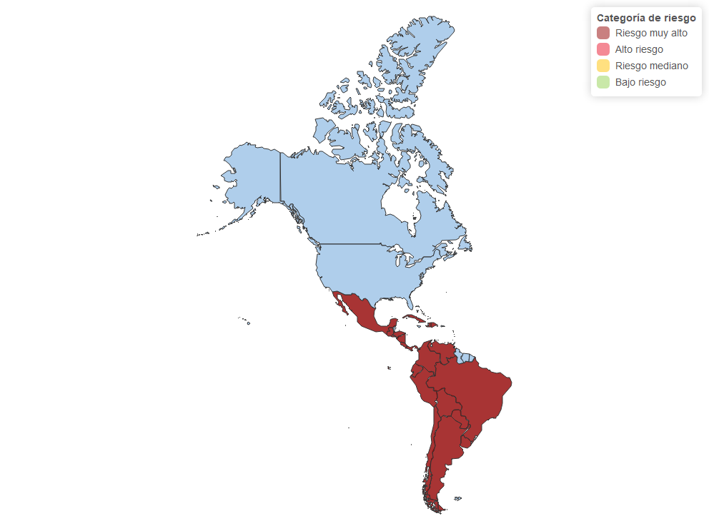
```


\newpage
## `r lang_label("title_name_section")` 6: `r lang_label("title_section_6")`

#### `r title_name_table` 6a: `r lang_label("title_table_6a")`, `r ref_country_name`, `r YEAR_1`-`r YEAR_5`.

```{r table_6a, echo=F}
risk_levels_df <- data.frame(level=get_risk_level(LANG_TLS,CUT_OFFS,"RAP_RES",respuesta_rapida_data$TOTAL_PR),n=1)
mun_risk_levels_df <- get_sec_table(risk_levels_df,lang_label("title_section_6"))
knitr::kable(mun_risk_levels_df,align = "lrrrrrr", booktabs = T)
```

#### `r title_name_figure` 6a: `r lang_label("title_figure_6a")`, `r ref_country_name`, `r YEAR_1`-`r YEAR_5`.
```{r figure_6a, echo=F, out.width="90%"}
fig_map <- resrapida_plot_map_data(LANG_TLS,COUNTRY_NAME,YEAR_LIST,ZERO_POB_LIST,CUT_OFFS,country_shapes,respuesta_rapida_data,"TOTAL_PR",rep_label_all,0,admin1_geo_id_df)
fig_map <- tidy_map(fig_map)

mapshot(fig_map, file = "figures/fig_6a.png",useragent = ZOOM_CONFIG)
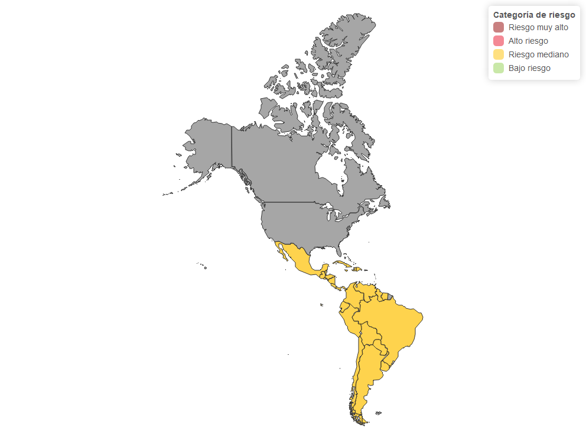
```

\newpage
#### `r title_name_figure` 6b: `r lang_label("title_figure_6b")`, `r ref_country_name`, `r YEAR_1`-`r YEAR_5`.
```{r figure_6b, echo=F, out.width="78%"}
fig_map <- resrapida_plot_map_data(LANG_TLS,COUNTRY_NAME,YEAR_LIST,ZERO_POB_LIST,CUT_OFFS,country_shapes,respuesta_rapida_data,"equipo",rep_label_all,0,admin1_geo_id_df)
fig_map <- tidy_map(fig_map)

mapshot(fig_map, file = "figures/fig_6b.png",useragent = ZOOM_CONFIG)
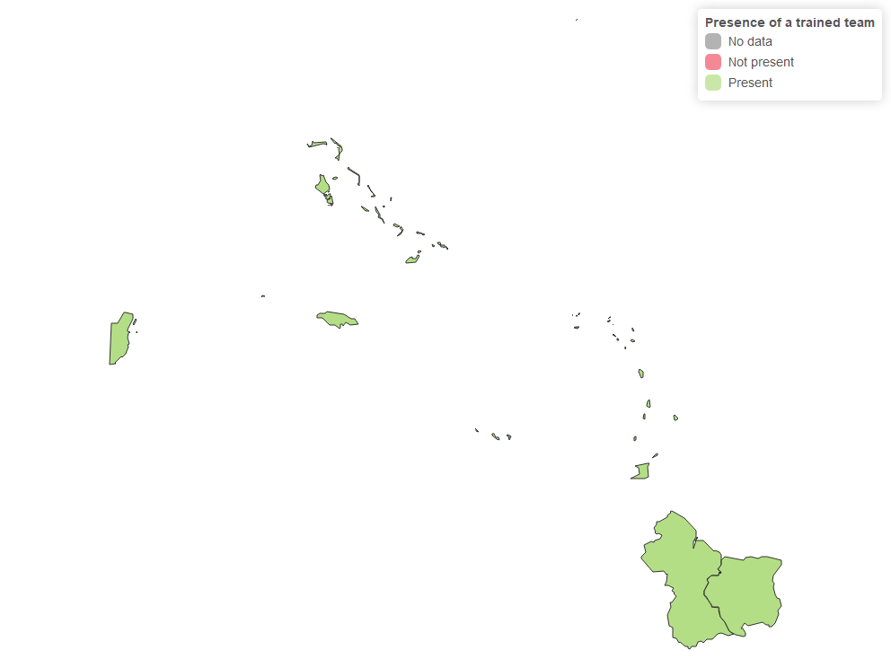
```

#### `r title_name_figure` 6c: `r lang_label("title_figure_6c")`, `r ref_country_name`, `r YEAR_1`-`r YEAR_5`.
```{r figure_6c, echo=F, out.width="78%"}
fig_map <- resrapida_plot_map_data(LANG_TLS,COUNTRY_NAME,YEAR_LIST,ZERO_POB_LIST,CUT_OFFS,country_shapes,respuesta_rapida_data,"hospitales_p",rep_label_all,0,admin1_geo_id_df)
fig_map <- tidy_map(fig_map)

mapshot(fig_map, file = "figures/fig_6c.png",useragent = ZOOM_CONFIG)
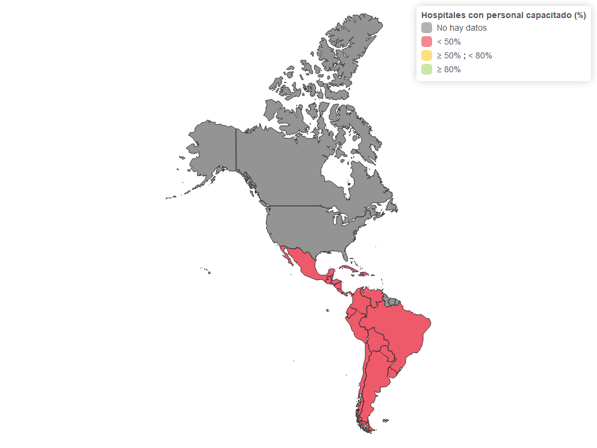
```


\newpage
# `r lang_label("title_apendix")`

#### `r lang_label("apendix_global_data")`
```{r table_global_data, echo=F}
config_data_table <- config_data
colnames(config_data_table) <- c(lang_label("apendix_global_data"),
                                 lang_label("apendix_globaldata_value"))
config_data_table[1] <- c(
  lang_label("apendix_globaldata_1"),
  lang_label("apendix_globaldata_2"),
  lang_label("apendix_globaldata_3"),
  lang_label("apendix_globaldata_4"),
  lang_label("apendix_globaldata_5"),
  lang_label("apendix_globaldata_6"),
  lang_label("apendix_globaldata_7"),
  lang_label("apendix_globaldata_8")
)

knitr::kable(config_data_table,align = "lc", booktabs = T)
```

#### `r lang_label("apendix_calc_data")`
```{r table_calc_vars, echo=F}
calc_camp_df <- data.frame(
  camp=c(
    lang_label("apendix_calcdata_1"),
    lang_label("apendix_calcdata_2"),
    lang_label("apendix_calcdata_3")
  ),
  val=c(YEAR_1,YEAR_5,paste0(YEAR_1,"-",YEAR_5)))
colnames(calc_camp_df) = c(lang_label("apendix_calcdata_4"),lang_label("apendix_calcdata_5"))

knitr::kable(calc_camp_df,align = "lc", booktabs = T)
```

#### `r lang_label("apendix_geoelement")`
```{r table_geoelements, echo=F}
geoelement_df <- data.frame(
  var=c(
    lang_label("apendix_geoelement_table_1"),
    lang_label("apendix_geoelement_table_2"),
    lang_label("apendix_geoelement_table_3"),
    lang_label("apendix_geoelement_table_4"),
    lang_label("apendix_geoelement_table_5")
  ),
  val=c(
    cFormat(length(country_shapes$geometry),0),
    cFormat(length(unique(country_shapes$ADMIN1)),0),
    cFormat(length(unique(country_shapes$GEO_ID)),0),
    cFormat(sum(pop_data$POB),0),
    cFormat(sum(pop_data$AREA),1)
  )
)
colnames(geoelement_df) = c(lang_label("apendix_geoelement_table_6"),lang_label("apendix_geoelement_table_7"))

knitr::kable(geoelement_df,align = "lc", booktabs = T)
```


